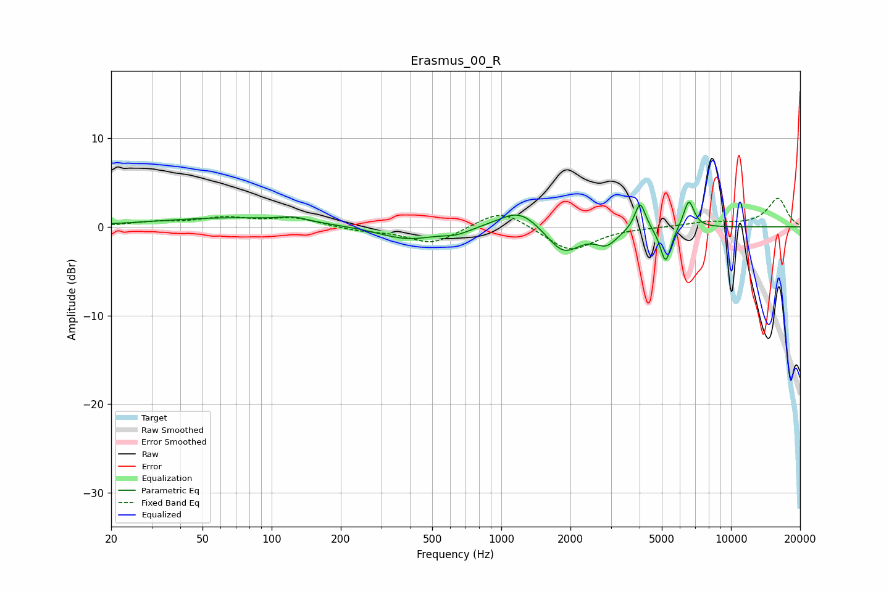

# Erasmus_00_R
See [usage instructions](https://github.com/jaakkopasanen/AutoEq#usage) for more options and info.

### Parametric EQs
Apply preamp of -2.9 dB when using parametric equalizer.

|   # | Type    |   Fc (Hz) |    Q |   Gain (dB) |
|-----|---------|-----------|------|-------------|
|   1 | Peaking |        68 | 0.44 |         1   |
|   2 | Peaking |       125 | 2.45 |         0.5 |
|   3 | Peaking |       391 | 1.1  |        -1.5 |
|   4 | Peaking |       640 | 2.37 |        -0.6 |
|   5 | Peaking |      1202 | 1.57 |         2.3 |
|   6 | Peaking |      1861 | 1.91 |        -3.1 |
|   7 | Peaking |      2872 | 3    |        -1.7 |
|   8 | Peaking |      4023 | 5.98 |         3.2 |
|   9 | Peaking |      5194 | 5.91 |        -4.1 |
|  10 | Peaking |      6555 | 5.99 |         3.2 |

### Fixed Band EQs
When using fixed band (also called graphic) equalizer, apply preamp of **-3.3 dB** (if available) and set gains manually with these parameters.

|   # | Type    |   Fc (Hz) |    Q |   Gain (dB) |
|-----|---------|-----------|------|-------------|
|   1 | Peaking |        31 | 1.41 |         0.5 |
|   2 | Peaking |        62 | 1.41 |         0.9 |
|   3 | Peaking |       125 | 1.41 |         1   |
|   4 | Peaking |       250 | 1.41 |        -0.4 |
|   5 | Peaking |       500 | 1.41 |        -1.9 |
|   6 | Peaking |      1000 | 1.41 |         2.1 |
|   7 | Peaking |      2000 | 1.41 |        -2.8 |
|   8 | Peaking |      4000 | 1.41 |        -0   |
|   9 | Peaking |      8000 | 1.41 |         0.5 |
|  10 | Peaking |     16000 | 1.41 |         3.2 |

### Graphs

