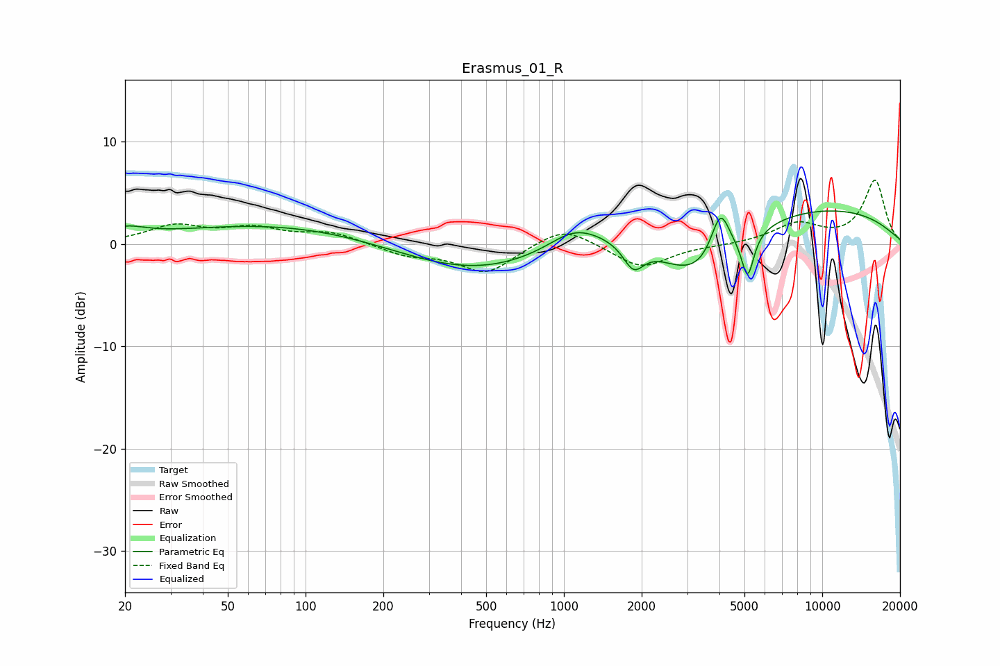

# Erasmus_01_R
See [usage instructions](https://github.com/jaakkopasanen/AutoEq#usage) for more options and info.

### Parametric EQs
Apply preamp of -3.3 dB when using parametric equalizer.

|   # | Type    |   Fc (Hz) |    Q |   Gain (dB) |
|-----|---------|-----------|------|-------------|
|   1 | Peaking |        20 | 1.81 |         1   |
|   2 | Peaking |        89 | 0.31 |         2.1 |
|   3 | Peaking |       456 | 0.43 |        -3.4 |
|   4 | Peaking |      1099 | 1.45 |         1.8 |
|   5 | Peaking |      1860 | 3.52 |        -2.5 |
|   6 | Peaking |      3044 | 0.9  |        -3.7 |
|   7 | Peaking |      3704 | 0.96 |        -2.9 |
|   8 | Peaking |      4034 | 3.77 |         4.7 |
|   9 | Peaking |      5144 | 6    |        -4.2 |
|  10 | Peaking |      5772 | 0.18 |         4.1 |

### Fixed Band EQs
When using fixed band (also called graphic) equalizer, apply preamp of **-6.3 dB** (if available) and set gains manually with these parameters.

|   # | Type    |   Fc (Hz) |    Q |   Gain (dB) |
|-----|---------|-----------|------|-------------|
|   1 | Peaking |        31 | 1.41 |         1.7 |
|   2 | Peaking |        62 | 1.41 |         1.4 |
|   3 | Peaking |       125 | 1.41 |         1.1 |
|   4 | Peaking |       250 | 1.41 |        -1   |
|   5 | Peaking |       500 | 1.41 |        -2.8 |
|   6 | Peaking |      1000 | 1.41 |         1.9 |
|   7 | Peaking |      2000 | 1.41 |        -2.4 |
|   8 | Peaking |      4000 | 1.41 |        -0.1 |
|   9 | Peaking |      8000 | 1.41 |         1.9 |
|  10 | Peaking |     16000 | 1.41 |         6.2 |

### Graphs

