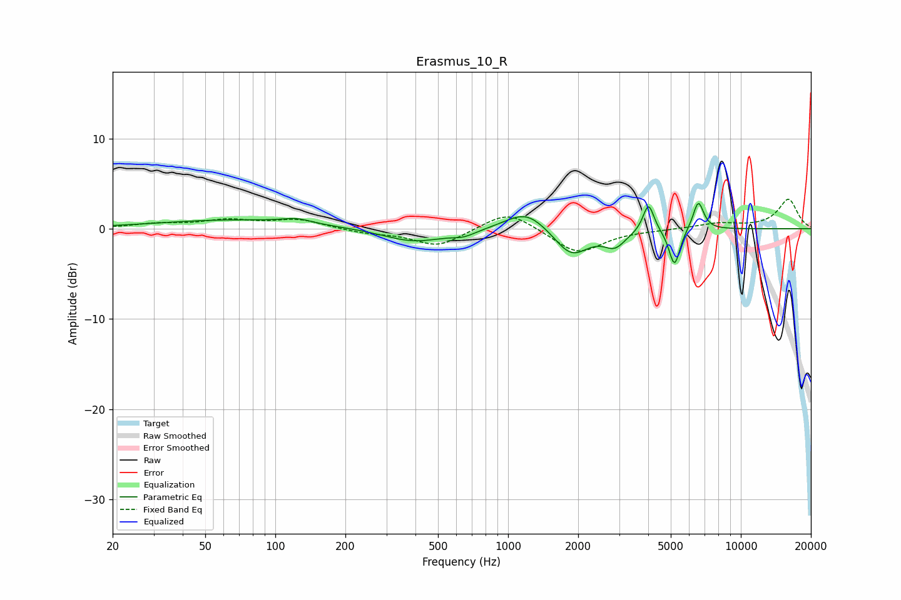

# Erasmus_10_R
See [usage instructions](https://github.com/jaakkopasanen/AutoEq#usage) for more options and info.

### Parametric EQs
Apply preamp of -2.9 dB when using parametric equalizer.

|   # | Type    |   Fc (Hz) |    Q |   Gain (dB) |
|-----|---------|-----------|------|-------------|
|   1 | Peaking |        68 | 0.43 |         1   |
|   2 | Peaking |       124 | 2.38 |         0.5 |
|   3 | Peaking |       395 | 1.06 |        -1.5 |
|   4 | Peaking |       646 | 2.69 |        -0.6 |
|   5 | Peaking |      1199 | 1.57 |         2.3 |
|   6 | Peaking |      1870 | 1.91 |        -3.1 |
|   7 | Peaking |      2874 | 3.07 |        -1.7 |
|   8 | Peaking |      4011 | 6    |         3.2 |
|   9 | Peaking |      5188 | 5.9  |        -4.2 |
|  10 | Peaking |      6566 | 5.96 |         3.2 |

### Fixed Band EQs
When using fixed band (also called graphic) equalizer, apply preamp of **-3.4 dB** (if available) and set gains manually with these parameters.

|   # | Type    |   Fc (Hz) |    Q |   Gain (dB) |
|-----|---------|-----------|------|-------------|
|   1 | Peaking |        31 | 1.41 |         0.5 |
|   2 | Peaking |        62 | 1.41 |         0.9 |
|   3 | Peaking |       125 | 1.41 |         1   |
|   4 | Peaking |       250 | 1.41 |        -0.4 |
|   5 | Peaking |       500 | 1.41 |        -2   |
|   6 | Peaking |      1000 | 1.41 |         2.1 |
|   7 | Peaking |      2000 | 1.41 |        -2.8 |
|   8 | Peaking |      4000 | 1.41 |        -0.1 |
|   9 | Peaking |      8000 | 1.41 |         0.6 |
|  10 | Peaking |     16000 | 1.41 |         3.2 |

### Graphs

