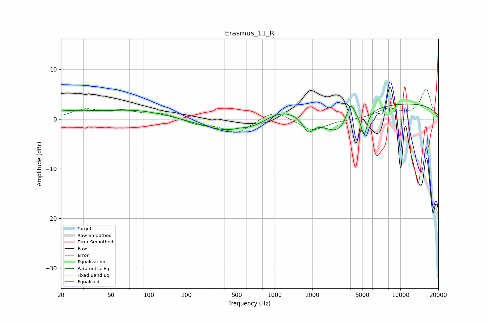

# Erasmus_11_R
See [usage instructions](https://github.com/jaakkopasanen/AutoEq#usage) for more options and info.

### Parametric EQs
Apply preamp of -3.1 dB when using parametric equalizer.

|   # | Type    |   Fc (Hz) |    Q |   Gain (dB) |
|-----|---------|-----------|------|-------------|
|   1 | Peaking |        43 | 0.7  |        -1.3 |
|   2 | Peaking |        46 | 0.35 |         3.1 |
|   3 | Peaking |       524 | 2.77 |         0.4 |
|   4 | Peaking |       527 | 0.53 |        -3.3 |
|   5 | Peaking |      1107 | 0.99 |         2.5 |
|   6 | Peaking |      1854 | 3.32 |        -2.9 |
|   7 | Peaking |      3198 | 1.06 |        -5.3 |
|   8 | Peaking |      4025 | 4.19 |         4.1 |
|   9 | Peaking |      5142 | 6    |        -4.7 |
|  10 | Peaking |      7923 | 0.18 |         3.4 |

### Fixed Band EQs
When using fixed band (also called graphic) equalizer, apply preamp of **-6.2 dB** (if available) and set gains manually with these parameters.

|   # | Type    |   Fc (Hz) |    Q |   Gain (dB) |
|-----|---------|-----------|------|-------------|
|   1 | Peaking |        31 | 1.41 |         1.8 |
|   2 | Peaking |        62 | 1.41 |         1.4 |
|   3 | Peaking |       125 | 1.41 |         1.1 |
|   4 | Peaking |       250 | 1.41 |        -1   |
|   5 | Peaking |       500 | 1.41 |        -2.8 |
|   6 | Peaking |      1000 | 1.41 |         2   |
|   7 | Peaking |      2000 | 1.41 |        -2.4 |
|   8 | Peaking |      4000 | 1.41 |        -0.1 |
|   9 | Peaking |      8000 | 1.41 |         2   |
|  10 | Peaking |     16000 | 1.41 |         6   |

### Graphs

