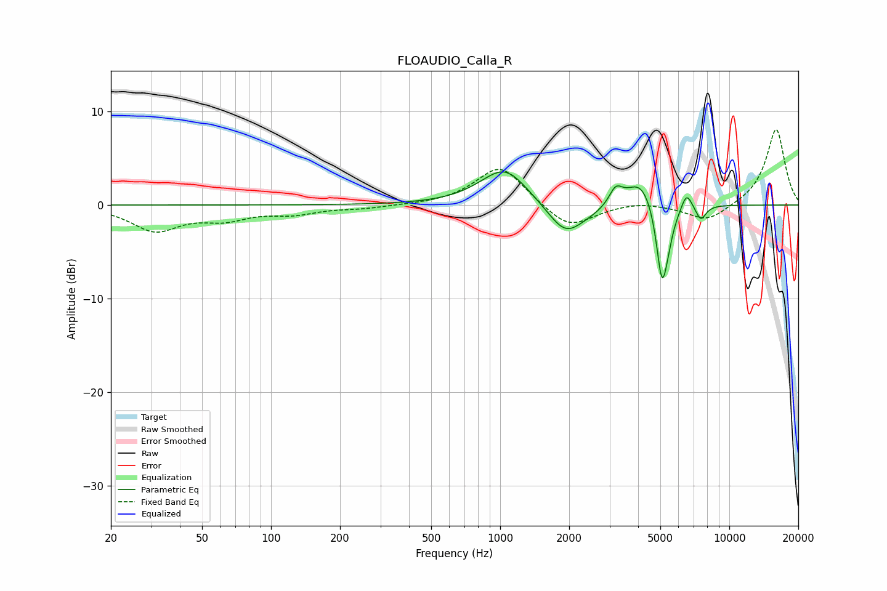

# FLOAUDIO_Calla_R
See [usage instructions](https://github.com/jaakkopasanen/AutoEq#usage) for more options and info.

### Parametric EQs
Apply preamp of -3.6 dB when using parametric equalizer.

|   # | Type    |   Fc (Hz) |    Q |   Gain (dB) |
|-----|---------|-----------|------|-------------|
|   1 | Peaking |       923 | 1.13 |         0.7 |
|   2 | Peaking |      1058 | 1.48 |         3.3 |
|   3 | Peaking |      1927 | 1.84 |        -3.3 |
|   4 | Peaking |      2532 | 1.59 |        -0.5 |
|   5 | Peaking |      3193 | 4.89 |         1.8 |
|   6 | Peaking |      4105 | 2.2  |         3   |
|   7 | Peaking |      5076 | 5.81 |        -7.4 |
|   8 | Peaking |      5345 | 4.54 |        -2.4 |
|   9 | Peaking |      6511 | 5.95 |         1.8 |
|  10 | Peaking |      7511 | 5.96 |        -1.6 |

### Fixed Band EQs
When using fixed band (also called graphic) equalizer, apply preamp of **-8.2 dB** (if available) and set gains manually with these parameters.

|   # | Type    |   Fc (Hz) |    Q |   Gain (dB) |
|-----|---------|-----------|------|-------------|
|   1 | Peaking |        31 | 1.41 |        -2.6 |
|   2 | Peaking |        62 | 1.41 |        -1.3 |
|   3 | Peaking |       125 | 1.41 |        -0.8 |
|   4 | Peaking |       250 | 1.41 |        -0.3 |
|   5 | Peaking |       500 | 1.41 |        -0   |
|   6 | Peaking |      1000 | 1.41 |         4.3 |
|   7 | Peaking |      2000 | 1.41 |        -2.7 |
|   8 | Peaking |      4000 | 1.41 |         0.4 |
|   9 | Peaking |      8000 | 1.41 |        -1.8 |
|  10 | Peaking |     16000 | 1.41 |         8.2 |

### Graphs

