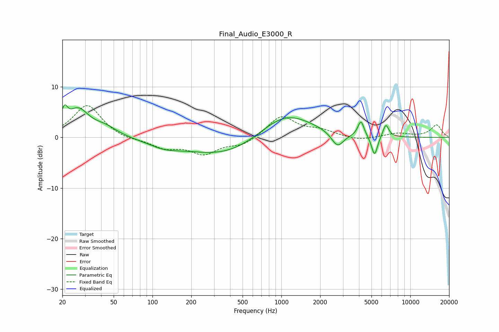

# Final_Audio_E3000_R
See [usage instructions](https://github.com/jaakkopasanen/AutoEq#usage) for more options and info.

### Parametric EQs
Apply preamp of -6.5 dB when using parametric equalizer.

|   # | Type    |   Fc (Hz) |    Q |   Gain (dB) |
|-----|---------|-----------|------|-------------|
|   1 | Peaking |        21 | 5.9  |         3.2 |
|   2 | Peaking |        26 | 1.7  |         5.1 |
|   3 | Peaking |        43 | 1.5  |         1.7 |
|   4 | Peaking |       123 | 1.14 |        -1.3 |
|   5 | Peaking |       385 | 0.46 |        -4   |
|   6 | Peaking |      1062 | 0.66 |         5.6 |
|   7 | Peaking |      2728 | 2.92 |        -3   |
|   8 | Peaking |      4143 | 5.94 |         3.1 |
|   9 | Peaking |      5281 | 5.88 |        -4   |
|  10 | Peaking |      6457 | 5.89 |         2.6 |

### Fixed Band EQs
When using fixed band (also called graphic) equalizer, apply preamp of **-6.4 dB** (if available) and set gains manually with these parameters.

|   # | Type    |   Fc (Hz) |    Q |   Gain (dB) |
|-----|---------|-----------|------|-------------|
|   1 | Peaking |        31 | 1.41 |         6.5 |
|   2 | Peaking |        62 | 1.41 |        -0.6 |
|   3 | Peaking |       125 | 1.41 |        -1.9 |
|   4 | Peaking |       250 | 1.41 |        -3   |
|   5 | Peaking |       500 | 1.41 |        -1.5 |
|   6 | Peaking |      1000 | 1.41 |         4.3 |
|   7 | Peaking |      2000 | 1.41 |         1.2 |
|   8 | Peaking |      4000 | 1.41 |        -0.7 |
|   9 | Peaking |      8000 | 1.41 |         0.8 |
|  10 | Peaking |     16000 | 1.41 |         2.4 |

### Graphs

