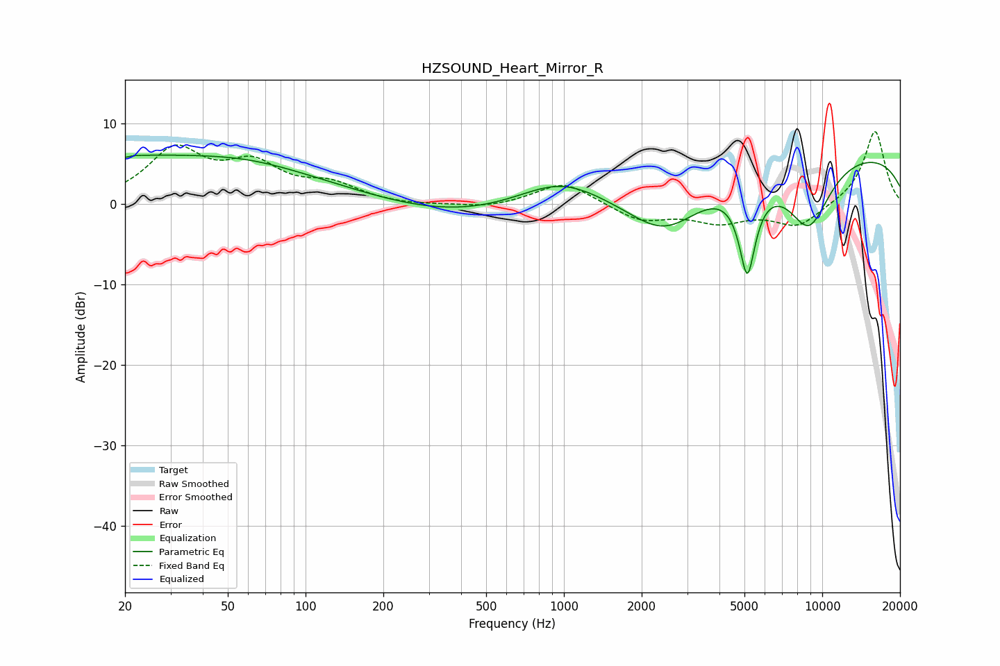

# HZSOUND_Heart_Mirror_R
See [usage instructions](https://github.com/jaakkopasanen/AutoEq#usage) for more options and info.

### Parametric EQs
Apply preamp of -6.2 dB when using parametric equalizer.

|   # | Type    |   Fc (Hz) |    Q |   Gain (dB) |
|-----|---------|-----------|------|-------------|
|   1 | Peaking |        20 | 5.9  |        -2.5 |
|   2 | Peaking |        20 | 5.74 |         2.2 |
|   3 | Peaking |        23 | 0.18 |         6   |
|   4 | Peaking |        60 | 0.81 |         0.6 |
|   5 | Peaking |       395 | 0.48 |        -1.8 |
|   6 | Peaking |       965 | 0.86 |         3.3 |
|   7 | Peaking |      2458 | 0.91 |        -6.5 |
|   8 | Peaking |      5129 | 4.22 |       -11.1 |
|   9 | Peaking |      8872 | 1.46 |        -8.6 |
|  10 | Peaking |     10000 | 0.19 |         6.9 |

### Fixed Band EQs
When using fixed band (also called graphic) equalizer, apply preamp of **-9.1 dB** (if available) and set gains manually with these parameters.

|   # | Type    |   Fc (Hz) |    Q |   Gain (dB) |
|-----|---------|-----------|------|-------------|
|   1 | Peaking |        31 | 1.41 |         6.4 |
|   2 | Peaking |        62 | 1.41 |         4.3 |
|   3 | Peaking |       125 | 1.41 |         2.1 |
|   4 | Peaking |       250 | 1.41 |        -0.3 |
|   5 | Peaking |       500 | 1.41 |        -0.5 |
|   6 | Peaking |      1000 | 1.41 |         2.8 |
|   7 | Peaking |      2000 | 1.41 |        -2.1 |
|   8 | Peaking |      4000 | 1.41 |        -2   |
|   9 | Peaking |      8000 | 1.41 |        -2.8 |
|  10 | Peaking |     16000 | 1.41 |         9.2 |

### Graphs

