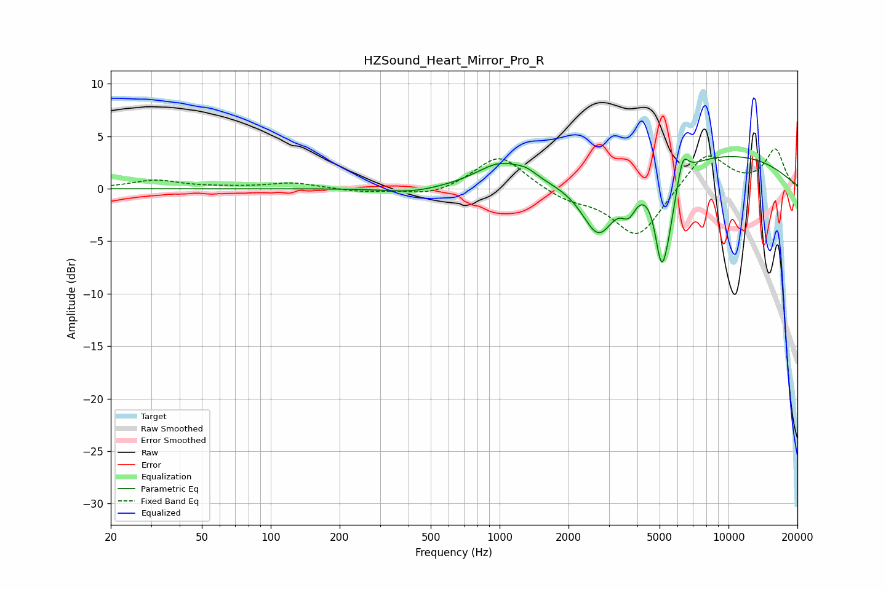

# HZSound_Heart_Mirror_Pro_R
See [usage instructions](https://github.com/jaakkopasanen/AutoEq#usage) for more options and info.

### Parametric EQs
Apply preamp of -3.2 dB when using parametric equalizer.

|   # | Type    |   Fc (Hz) |    Q |   Gain (dB) |
|-----|---------|-----------|------|-------------|
|   1 | Peaking |       416 | 1.23 |        -0.5 |
|   2 | Peaking |      1015 | 1.29 |         2.3 |
|   3 | Peaking |      1316 | 3.19 |         0.6 |
|   4 | Peaking |      2591 | 1.93 |        -0.6 |
|   5 | Peaking |      2718 | 2.01 |        -4.7 |
|   6 | Peaking |      3666 | 4.36 |        -2.1 |
|   7 | Peaking |      5082 | 5.06 |        -6   |
|   8 | Peaking |      5427 | 3.67 |        -3.9 |
|   9 | Peaking |      6317 | 6    |         2.3 |
|  10 | Peaking |      9144 | 0.34 |         3.3 |

### Fixed Band EQs
When using fixed band (also called graphic) equalizer, apply preamp of **-3.9 dB** (if available) and set gains manually with these parameters.

|   # | Type    |   Fc (Hz) |    Q |   Gain (dB) |
|-----|---------|-----------|------|-------------|
|   1 | Peaking |        31 | 1.41 |         0.8 |
|   2 | Peaking |        62 | 1.41 |         0.1 |
|   3 | Peaking |       125 | 1.41 |         0.6 |
|   4 | Peaking |       250 | 1.41 |        -0.3 |
|   5 | Peaking |       500 | 1.41 |        -0.7 |
|   6 | Peaking |      1000 | 1.41 |         3.3 |
|   7 | Peaking |      2000 | 1.41 |        -1   |
|   8 | Peaking |      4000 | 1.41 |        -4.7 |
|   9 | Peaking |      8000 | 1.41 |         3.6 |
|  10 | Peaking |     16000 | 1.41 |         3.7 |

### Graphs

