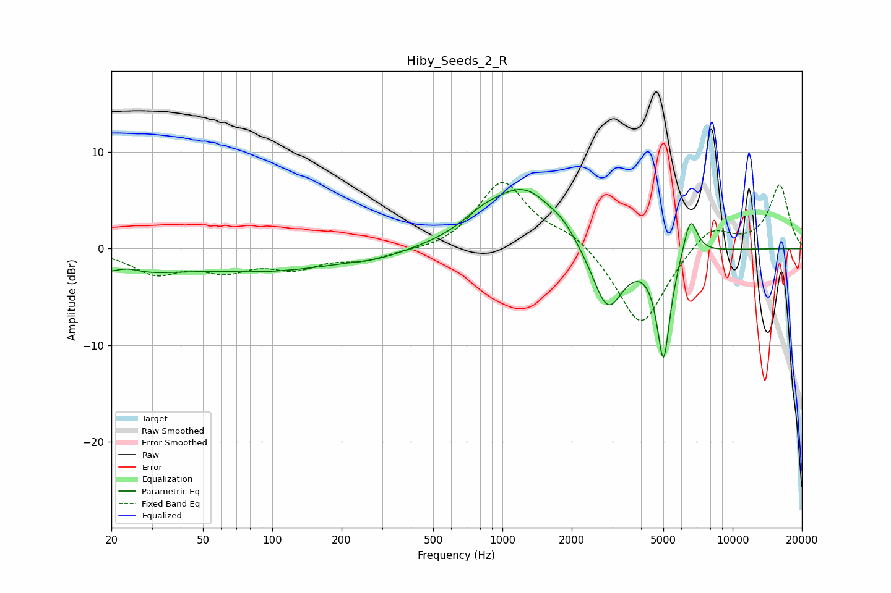

# Hiby_Seeds_2_R
See [usage instructions](https://github.com/jaakkopasanen/AutoEq#usage) for more options and info.

### Parametric EQs
Apply preamp of -6.2 dB when using parametric equalizer.

|   # | Type    |   Fc (Hz) |    Q |   Gain (dB) |
|-----|---------|-----------|------|-------------|
|   1 | Peaking |        21 | 0.6  |        -2.4 |
|   2 | Peaking |        23 | 2.45 |         0.7 |
|   3 | Peaking |       101 | 0.44 |        -2.1 |
|   4 | Peaking |       292 | 1.25 |        -0.5 |
|   5 | Peaking |       824 | 1.42 |         1.5 |
|   6 | Peaking |      1259 | 0.98 |         5.9 |
|   7 | Peaking |      1837 | 2.81 |         0.7 |
|   8 | Peaking |      2862 | 2.02 |        -7   |
|   9 | Peaking |      5009 | 4.71 |       -11.2 |
|  10 | Peaking |      6549 | 4.46 |         4.2 |

### Fixed Band EQs
When using fixed band (also called graphic) equalizer, apply preamp of **-6.9 dB** (if available) and set gains manually with these parameters.

|   # | Type    |   Fc (Hz) |    Q |   Gain (dB) |
|-----|---------|-----------|------|-------------|
|   1 | Peaking |        31 | 1.41 |        -2.4 |
|   2 | Peaking |        62 | 1.41 |        -1.9 |
|   3 | Peaking |       125 | 1.41 |        -1.8 |
|   4 | Peaking |       250 | 1.41 |        -1.1 |
|   5 | Peaking |       500 | 1.41 |        -0.4 |
|   6 | Peaking |      1000 | 1.41 |         7   |
|   7 | Peaking |      2000 | 1.41 |         1.5 |
|   8 | Peaking |      4000 | 1.41 |        -8.4 |
|   9 | Peaking |      8000 | 1.41 |         2.6 |
|  10 | Peaking |     16000 | 1.41 |         6.6 |

### Graphs

