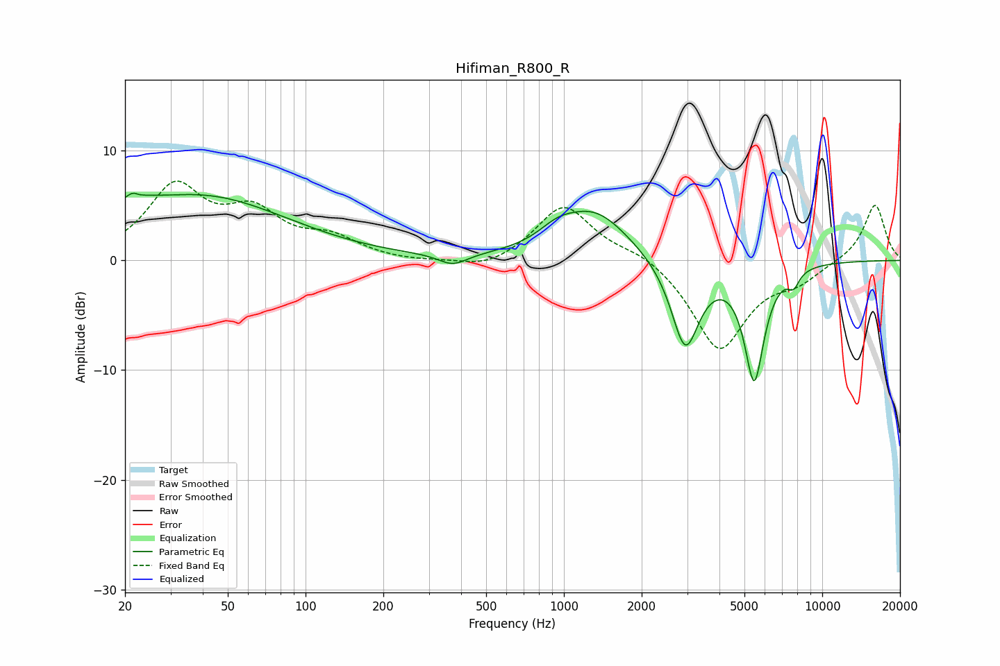

# Hifiman_R800_R
See [usage instructions](https://github.com/jaakkopasanen/AutoEq#usage) for more options and info.

### Parametric EQs
Apply preamp of -6.2 dB when using parametric equalizer.

|   # | Type    |   Fc (Hz) |    Q |   Gain (dB) |
|-----|---------|-----------|------|-------------|
|   1 | Peaking |        20 | 1.37 |         1.4 |
|   2 | Peaking |        22 | 5.91 |         3.2 |
|   3 | Peaking |        22 | 5.98 |        -2.8 |
|   4 | Peaking |        40 | 0.42 |         5.7 |
|   5 | Peaking |       371 | 2.53 |        -1   |
|   6 | Peaking |       941 | 1.99 |         1.2 |
|   7 | Peaking |      1316 | 1.04 |         4.4 |
|   8 | Peaking |      2949 | 2.55 |        -8.2 |
|   9 | Peaking |      5455 | 3.54 |       -10.5 |
|  10 | Peaking |      7747 | 6    |        -1.3 |

### Fixed Band EQs
When using fixed band (also called graphic) equalizer, apply preamp of **-7.3 dB** (if available) and set gains manually with these parameters.

|   # | Type    |   Fc (Hz) |    Q |   Gain (dB) |
|-----|---------|-----------|------|-------------|
|   1 | Peaking |        31 | 1.41 |         6.4 |
|   2 | Peaking |        62 | 1.41 |         3.8 |
|   3 | Peaking |       125 | 1.41 |         1.8 |
|   4 | Peaking |       250 | 1.41 |        -0.2 |
|   5 | Peaking |       500 | 1.41 |        -0.9 |
|   6 | Peaking |      1000 | 1.41 |         5.1 |
|   7 | Peaking |      2000 | 1.41 |         0.9 |
|   8 | Peaking |      4000 | 1.41 |        -8.2 |
|   9 | Peaking |      8000 | 1.41 |        -1.5 |
|  10 | Peaking |     16000 | 1.41 |         5.2 |

### Graphs

