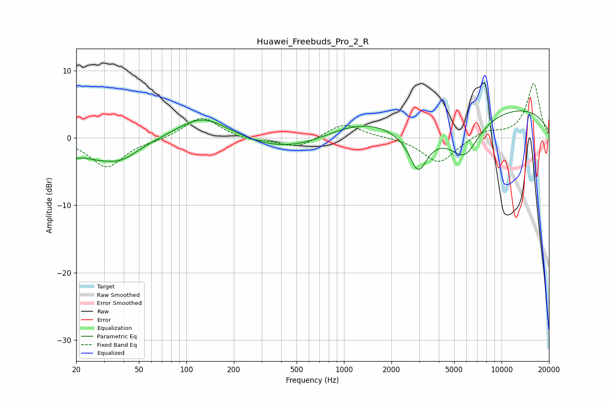

# Huawei_Freebuds_Pro_2_R
See [usage instructions](https://github.com/jaakkopasanen/AutoEq#usage) for more options and info.

### Parametric EQs
Apply preamp of -4.1 dB when using parametric equalizer.

|   # | Type    |   Fc (Hz) |    Q |   Gain (dB) |
|-----|---------|-----------|------|-------------|
|   1 | Peaking |        20 | 0.54 |        -3.8 |
|   2 | Peaking |        22 | 1.9  |         1   |
|   3 | Peaking |        39 | 1.47 |        -1.4 |
|   4 | Peaking |       126 | 0.88 |         3.5 |
|   5 | Peaking |       458 | 0.54 |        -2.2 |
|   6 | Peaking |      1447 | 0.53 |         4.1 |
|   7 | Peaking |      2933 | 0.45 |        -4.4 |
|   8 | Peaking |      2959 | 2.56 |        -5.3 |
|   9 | Peaking |      5832 | 1.55 |        -4.8 |
|  10 | Peaking |      8711 | 0.22 |         5.2 |

### Fixed Band EQs
When using fixed band (also called graphic) equalizer, apply preamp of **-8.1 dB** (if available) and set gains manually with these parameters.

|   # | Type    |   Fc (Hz) |    Q |   Gain (dB) |
|-----|---------|-----------|------|-------------|
|   1 | Peaking |        31 | 1.41 |        -4.3 |
|   2 | Peaking |        62 | 1.41 |        -0.3 |
|   3 | Peaking |       125 | 1.41 |         3.2 |
|   4 | Peaking |       250 | 1.41 |        -0.5 |
|   5 | Peaking |       500 | 1.41 |        -1.5 |
|   6 | Peaking |      1000 | 1.41 |         2.2 |
|   7 | Peaking |      2000 | 1.41 |         0.1 |
|   8 | Peaking |      4000 | 1.41 |        -3.8 |
|   9 | Peaking |      8000 | 1.41 |         1.1 |
|  10 | Peaking |     16000 | 1.41 |         8.1 |

### Graphs

