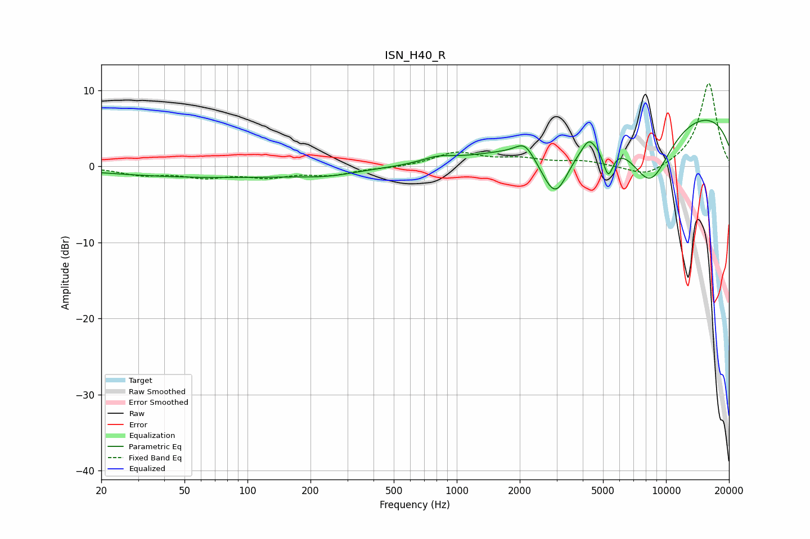

# ISN_H40_R
See [usage instructions](https://github.com/jaakkopasanen/AutoEq#usage) for more options and info.

### Parametric EQs
Apply preamp of -6.2 dB when using parametric equalizer.

|   # | Type    |   Fc (Hz) |    Q |   Gain (dB) |
|-----|---------|-----------|------|-------------|
|   1 | Peaking |        72 | 0.26 |        -1.4 |
|   2 | Peaking |       244 | 1.11 |        -0.5 |
|   3 | Peaking |       809 | 1.93 |         0.7 |
|   4 | Peaking |      2115 | 3.26 |         1.8 |
|   5 | Peaking |      2958 | 1.94 |        -7.8 |
|   6 | Peaking |      4274 | 4.86 |         1.4 |
|   7 | Peaking |      5294 | 5.51 |        -4   |
|   8 | Peaking |      5579 | 6    |         0   |
|   9 | Peaking |      8395 | 1.18 |        -9.1 |
|  10 | Peaking |     10000 | 0.18 |         8   |

### Fixed Band EQs
When using fixed band (also called graphic) equalizer, apply preamp of **-11.0 dB** (if available) and set gains manually with these parameters.

|   # | Type    |   Fc (Hz) |    Q |   Gain (dB) |
|-----|---------|-----------|------|-------------|
|   1 | Peaking |        31 | 1.41 |        -1   |
|   2 | Peaking |        62 | 1.41 |        -1.2 |
|   3 | Peaking |       125 | 1.41 |        -1.2 |
|   4 | Peaking |       250 | 1.41 |        -1   |
|   5 | Peaking |       500 | 1.41 |        -0.2 |
|   6 | Peaking |      1000 | 1.41 |         1.8 |
|   7 | Peaking |      2000 | 1.41 |         0.9 |
|   8 | Peaking |      4000 | 1.41 |         0.6 |
|   9 | Peaking |      8000 | 1.41 |        -1.5 |
|  10 | Peaking |     16000 | 1.41 |        11.1 |

### Graphs

