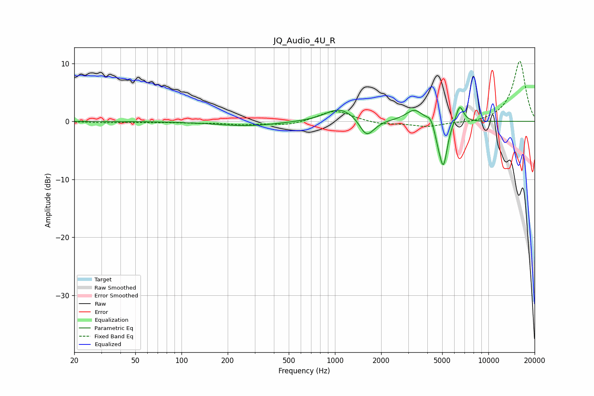

# JQ_Audio_4U_R
See [usage instructions](https://github.com/jaakkopasanen/AutoEq#usage) for more options and info.

### Parametric EQs
Apply preamp of -2.5 dB when using parametric equalizer.

|   # | Type    |   Fc (Hz) |    Q |   Gain (dB) |
|-----|---------|-----------|------|-------------|
|   1 | Peaking |       268 | 0.71 |        -0.8 |
|   2 | Peaking |      1046 | 1.6  |         1.8 |
|   3 | Peaking |      1328 | 1.31 |         0.9 |
|   4 | Peaking |      1593 | 3.1  |        -2.8 |
|   5 | Peaking |      1713 | 2.44 |        -0.8 |
|   6 | Peaking |      3304 | 2.52 |         2.1 |
|   7 | Peaking |      4195 | 6    |         1.1 |
|   8 | Peaking |      4728 | 6    |        -1.9 |
|   9 | Peaking |      5099 | 5.45 |        -7.3 |
|  10 | Peaking |      6497 | 5.38 |         3.1 |

### Fixed Band EQs
When using fixed band (also called graphic) equalizer, apply preamp of **-10.5 dB** (if available) and set gains manually with these parameters.

|   # | Type    |   Fc (Hz) |    Q |   Gain (dB) |
|-----|---------|-----------|------|-------------|
|   1 | Peaking |        31 | 1.41 |        -0.2 |
|   2 | Peaking |        62 | 1.41 |        -0.1 |
|   3 | Peaking |       125 | 1.41 |        -0.2 |
|   4 | Peaking |       250 | 1.41 |        -0.5 |
|   5 | Peaking |       500 | 1.41 |        -0.7 |
|   6 | Peaking |      1000 | 1.41 |         2   |
|   7 | Peaking |      2000 | 1.41 |        -0.5 |
|   8 | Peaking |      4000 | 1.41 |        -0.9 |
|   9 | Peaking |      8000 | 1.41 |        -0.3 |
|  10 | Peaking |     16000 | 1.41 |        10.5 |

### Graphs

