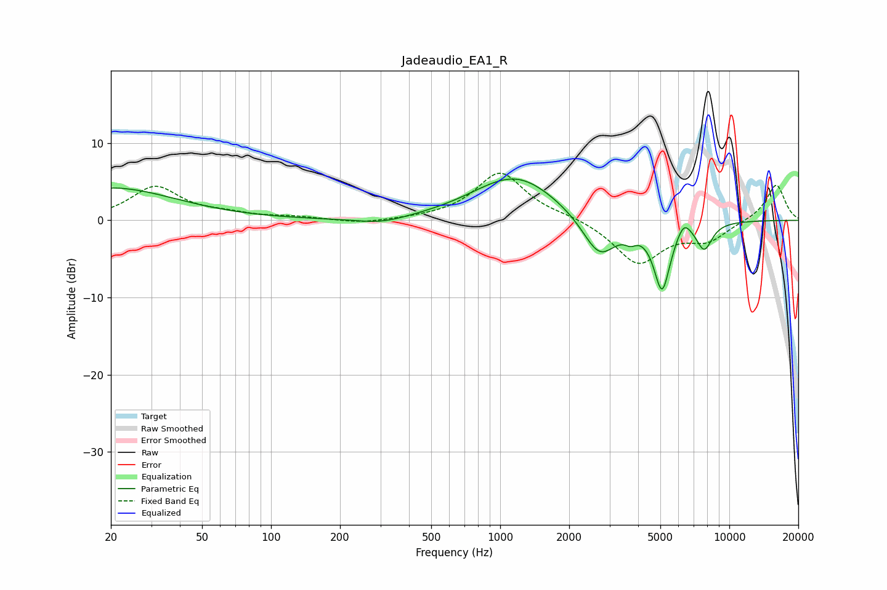

# Jadeaudio_EA1_R
See [usage instructions](https://github.com/jaakkopasanen/AutoEq#usage) for more options and info.

### Parametric EQs
Apply preamp of -5.4 dB when using parametric equalizer.

|   # | Type    |   Fc (Hz) |    Q |   Gain (dB) |
|-----|---------|-----------|------|-------------|
|   1 | Peaking |        20 | 0.5  |         4.2 |
|   2 | Peaking |       304 | 1.29 |        -0.8 |
|   3 | Peaking |       884 | 0.92 |         0.5 |
|   4 | Peaking |      1089 | 5.27 |        -0   |
|   5 | Peaking |      1194 | 0.79 |         5.4 |
|   6 | Peaking |      2709 | 1.87 |        -5.4 |
|   7 | Peaking |      3709 | 5.6  |        -1   |
|   8 | Peaking |      5087 | 3.77 |        -8.8 |
|   9 | Peaking |      6327 | 4.39 |         1.9 |
|  10 | Peaking |      7773 | 3.86 |        -3.4 |

### Fixed Band EQs
When using fixed band (also called graphic) equalizer, apply preamp of **-6.2 dB** (if available) and set gains manually with these parameters.

|   # | Type    |   Fc (Hz) |    Q |   Gain (dB) |
|-----|---------|-----------|------|-------------|
|   1 | Peaking |        31 | 1.41 |         4.3 |
|   2 | Peaking |        62 | 1.41 |         0.6 |
|   3 | Peaking |       125 | 1.41 |         0.4 |
|   4 | Peaking |       250 | 1.41 |        -0.5 |
|   5 | Peaking |       500 | 1.41 |         0.1 |
|   6 | Peaking |      1000 | 1.41 |         6.2 |
|   7 | Peaking |      2000 | 1.41 |         0.4 |
|   8 | Peaking |      4000 | 1.41 |        -5.6 |
|   9 | Peaking |      8000 | 1.41 |        -2.4 |
|  10 | Peaking |     16000 | 1.41 |         4.7 |

### Graphs

