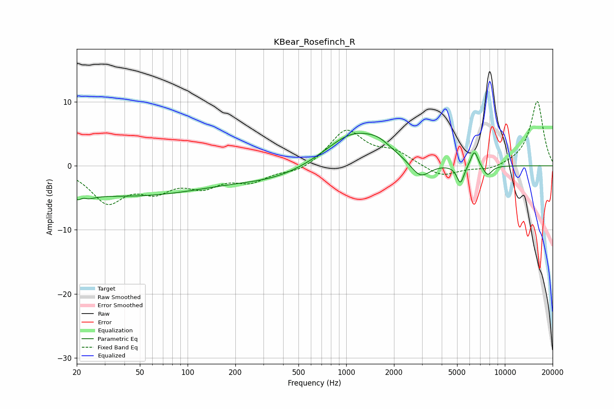

# KBear_Rosefinch_R
See [usage instructions](https://github.com/jaakkopasanen/AutoEq#usage) for more options and info.

### Parametric EQs
Apply preamp of -5.2 dB when using parametric equalizer.

|   # | Type    |   Fc (Hz) |    Q |   Gain (dB) |
|-----|---------|-----------|------|-------------|
|   1 | Peaking |        22 | 3.55 |        -5.1 |
|   2 | Peaking |        22 | 4.46 |         4   |
|   3 | Peaking |        42 | 0.26 |        -4.6 |
|   4 | Peaking |       360 | 0.56 |        -1.8 |
|   5 | Peaking |      1112 | 0.79 |         5.3 |
|   6 | Peaking |      1601 | 1.91 |         1.1 |
|   7 | Peaking |      2931 | 2.25 |        -2.7 |
|   8 | Peaking |      5249 | 6    |        -2.9 |
|   9 | Peaking |      6419 | 5.94 |         2.6 |
|  10 | Peaking |      7778 | 4.66 |        -1.6 |

### Fixed Band EQs
When using fixed band (also called graphic) equalizer, apply preamp of **-10.1 dB** (if available) and set gains manually with these parameters.

|   # | Type    |   Fc (Hz) |    Q |   Gain (dB) |
|-----|---------|-----------|------|-------------|
|   1 | Peaking |        31 | 1.41 |        -5.3 |
|   2 | Peaking |        62 | 1.41 |        -3.2 |
|   3 | Peaking |       125 | 1.41 |        -2.7 |
|   4 | Peaking |       250 | 1.41 |        -2.1 |
|   5 | Peaking |       500 | 1.41 |        -1   |
|   6 | Peaking |      1000 | 1.41 |         5.6 |
|   7 | Peaking |      2000 | 1.41 |         1.9 |
|   8 | Peaking |      4000 | 1.41 |        -1.8 |
|   9 | Peaking |      8000 | 1.41 |        -0.7 |
|  10 | Peaking |     16000 | 1.41 |        10.2 |

### Graphs

