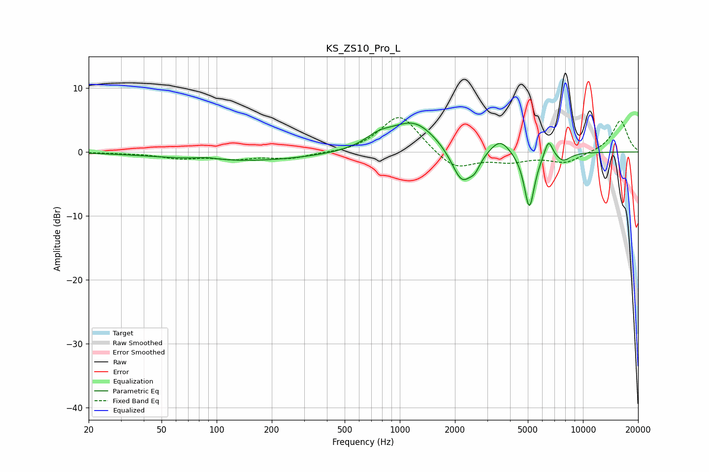

# KS_ZS10_Pro_L
See [usage instructions](https://github.com/jaakkopasanen/AutoEq#usage) for more options and info.

### Parametric EQs
Apply preamp of -4.6 dB when using parametric equalizer.

|   # | Type    |   Fc (Hz) |    Q |   Gain (dB) |
|-----|---------|-----------|------|-------------|
|   1 | Peaking |        88 | 2.21 |         0.4 |
|   2 | Peaking |       139 | 0.35 |        -1.4 |
|   3 | Peaking |       766 | 1.95 |         1.4 |
|   4 | Peaking |      1194 | 1.09 |         4.8 |
|   5 | Peaking |      2184 | 2.44 |        -5.7 |
|   6 | Peaking |      2572 | 5.03 |        -1.5 |
|   7 | Peaking |      3525 | 2.63 |         2.4 |
|   8 | Peaking |      5096 | 4.84 |        -9   |
|   9 | Peaking |      6487 | 5.97 |         2.8 |
|  10 | Peaking |      7783 | 3.26 |        -1.3 |

### Fixed Band EQs
When using fixed band (also called graphic) equalizer, apply preamp of **-5.5 dB** (if available) and set gains manually with these parameters.

|   # | Type    |   Fc (Hz) |    Q |   Gain (dB) |
|-----|---------|-----------|------|-------------|
|   1 | Peaking |        31 | 1.41 |        -0.1 |
|   2 | Peaking |        62 | 1.41 |        -0.9 |
|   3 | Peaking |       125 | 1.41 |        -0.9 |
|   4 | Peaking |       250 | 1.41 |        -1   |
|   5 | Peaking |       500 | 1.41 |        -0.3 |
|   6 | Peaking |      1000 | 1.41 |         6   |
|   7 | Peaking |      2000 | 1.41 |        -2.9 |
|   8 | Peaking |      4000 | 1.41 |        -1.3 |
|   9 | Peaking |      8000 | 1.41 |        -1.6 |
|  10 | Peaking |     16000 | 1.41 |         5   |

### Graphs

