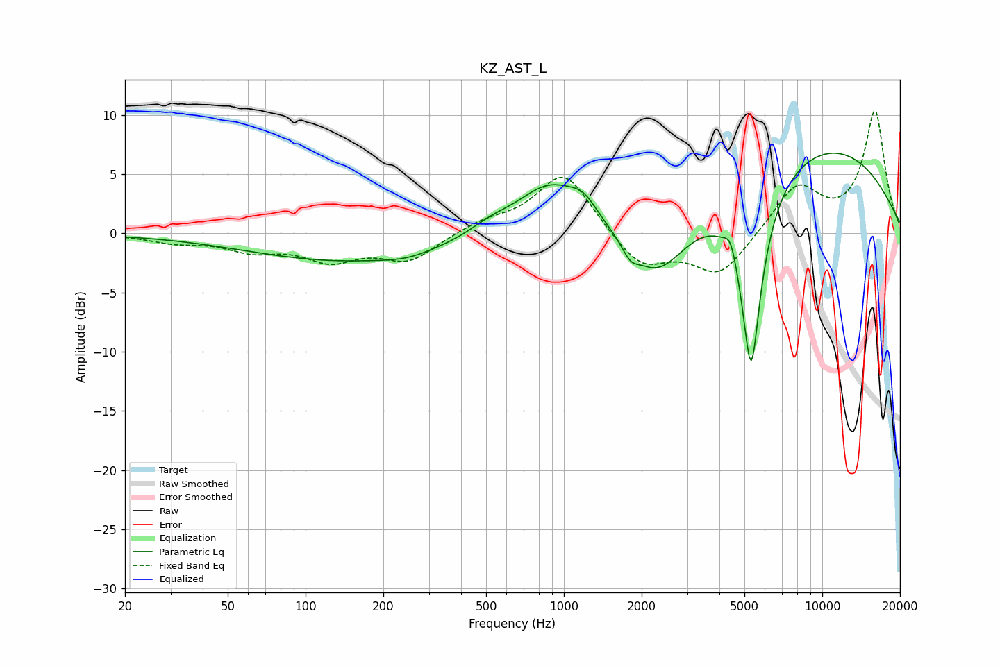

# KZ_AST_L
See [usage instructions](https://github.com/jaakkopasanen/AutoEq#usage) for more options and info.

### Parametric EQs
Apply preamp of -6.9 dB when using parametric equalizer.

|   # | Type    |   Fc (Hz) |    Q |   Gain (dB) |
|-----|---------|-----------|------|-------------|
|   1 | Peaking |       147 | 0.36 |        -2.3 |
|   2 | Peaking |       247 | 1.56 |        -0.4 |
|   3 | Peaking |       519 | 1.75 |         0.8 |
|   4 | Peaking |       879 | 1.09 |         4.2 |
|   5 | Peaking |      1192 | 2.57 |         1.4 |
|   6 | Peaking |      1806 | 4.75 |        -1   |
|   7 | Peaking |      2288 | 1.22 |        -5   |
|   8 | Peaking |      4427 | 6    |         1.6 |
|   9 | Peaking |      5308 | 3.29 |       -16.1 |
|  10 | Peaking |      9700 | 0.34 |         7.5 |

### Fixed Band EQs
When using fixed band (also called graphic) equalizer, apply preamp of **-10.4 dB** (if available) and set gains manually with these parameters.

|   # | Type    |   Fc (Hz) |    Q |   Gain (dB) |
|-----|---------|-----------|------|-------------|
|   1 | Peaking |        31 | 1.41 |        -0.6 |
|   2 | Peaking |        62 | 1.41 |        -1.2 |
|   3 | Peaking |       125 | 1.41 |        -2   |
|   4 | Peaking |       250 | 1.41 |        -2.2 |
|   5 | Peaking |       500 | 1.41 |         0.9 |
|   6 | Peaking |      1000 | 1.41 |         5.3 |
|   7 | Peaking |      2000 | 1.41 |        -3   |
|   8 | Peaking |      4000 | 1.41 |        -3.5 |
|   9 | Peaking |      8000 | 1.41 |         4   |
|  10 | Peaking |     16000 | 1.41 |        10.2 |

### Graphs

