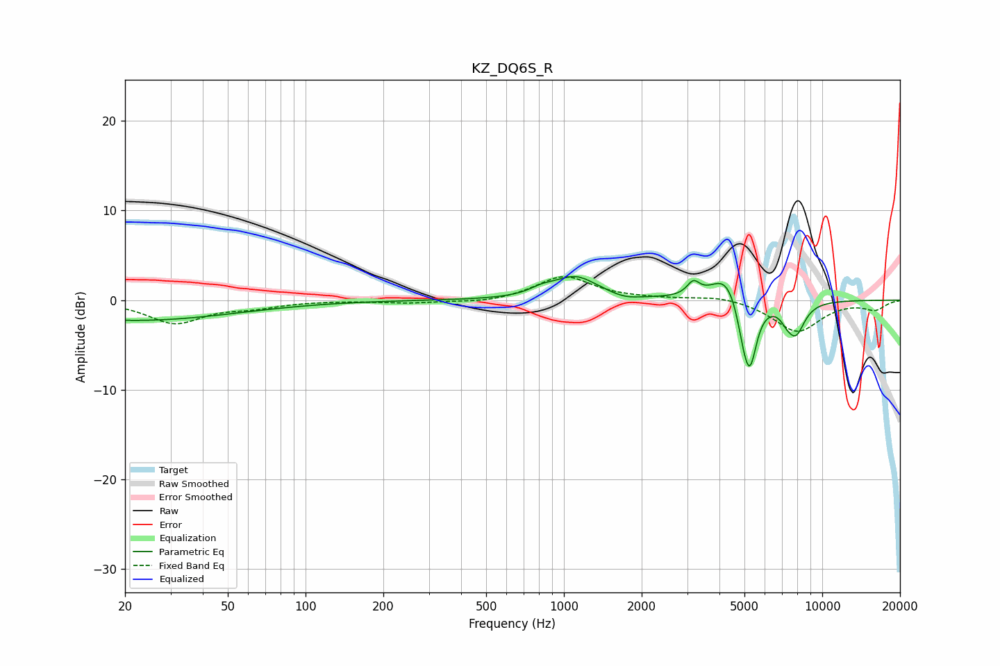

# KZ_DQ6S_R
See [usage instructions](https://github.com/jaakkopasanen/AutoEq#usage) for more options and info.

### Parametric EQs
Apply preamp of -2.7 dB when using parametric equalizer.

|   # | Type    |   Fc (Hz) |    Q |   Gain (dB) |
|-----|---------|-----------|------|-------------|
|   1 | Peaking |        22 | 0.36 |        -2.3 |
|   2 | Peaking |       823 | 2.93 |         0.6 |
|   3 | Peaking |      1111 | 1.68 |         2.5 |
|   4 | Peaking |      1728 | 2.78 |        -0.4 |
|   5 | Peaking |      3170 | 5.84 |         1.5 |
|   6 | Peaking |      4240 | 2.42 |         3   |
|   7 | Peaking |      4922 | 6    |        -2.2 |
|   8 | Peaking |      5245 | 5.04 |        -7.2 |
|   9 | Peaking |      7267 | 6    |        -0.8 |
|  10 | Peaking |      7890 | 3.71 |        -3.5 |

### Fixed Band EQs
When using fixed band (also called graphic) equalizer, apply preamp of **-2.7 dB** (if available) and set gains manually with these parameters.

|   # | Type    |   Fc (Hz) |    Q |   Gain (dB) |
|-----|---------|-----------|------|-------------|
|   1 | Peaking |        31 | 1.41 |        -2.5 |
|   2 | Peaking |        62 | 1.41 |        -0.7 |
|   3 | Peaking |       125 | 1.41 |        -0   |
|   4 | Peaking |       250 | 1.41 |        -0.3 |
|   5 | Peaking |       500 | 1.41 |        -0.4 |
|   6 | Peaking |      1000 | 1.41 |         2.7 |
|   7 | Peaking |      2000 | 1.41 |         0.1 |
|   8 | Peaking |      4000 | 1.41 |         0.5 |
|   9 | Peaking |      8000 | 1.41 |        -3.5 |
|  10 | Peaking |     16000 | 1.41 |        -1   |

### Graphs

