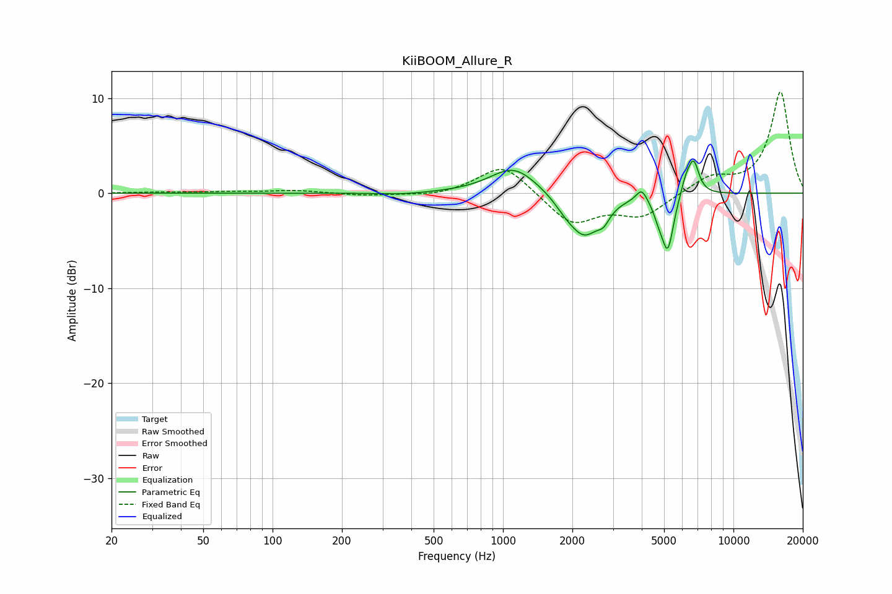

# KiiBOOM_Allure_R
See [usage instructions](https://github.com/jaakkopasanen/AutoEq#usage) for more options and info.

### Parametric EQs
Apply preamp of -3.5 dB when using parametric equalizer.

|   # | Type    |   Fc (Hz) |    Q |   Gain (dB) |
|-----|---------|-----------|------|-------------|
|   1 | Peaking |       366 | 1.37 |        -0.2 |
|   2 | Peaking |      1114 | 1.38 |         2.9 |
|   3 | Peaking |      1862 | 2.93 |        -0.8 |
|   4 | Peaking |      2254 | 2.03 |        -4.3 |
|   5 | Peaking |      2733 | 5.4  |        -1.1 |
|   6 | Peaking |      3997 | 6    |         1.4 |
|   7 | Peaking |      4744 | 6    |        -1.3 |
|   8 | Peaking |      5190 | 5.47 |        -5.6 |
|   9 | Peaking |      6222 | 5.98 |         1.6 |
|  10 | Peaking |      6722 | 5.86 |         3.3 |

### Fixed Band EQs
When using fixed band (also called graphic) equalizer, apply preamp of **-10.8 dB** (if available) and set gains manually with these parameters.

|   # | Type    |   Fc (Hz) |    Q |   Gain (dB) |
|-----|---------|-----------|------|-------------|
|   1 | Peaking |        31 | 1.41 |         0.1 |
|   2 | Peaking |        62 | 1.41 |         0.1 |
|   3 | Peaking |       125 | 1.41 |         0.3 |
|   4 | Peaking |       250 | 1.41 |        -0.3 |
|   5 | Peaking |       500 | 1.41 |        -0.4 |
|   6 | Peaking |      1000 | 1.41 |         3.2 |
|   7 | Peaking |      2000 | 1.41 |        -3.3 |
|   8 | Peaking |      4000 | 1.41 |        -2.3 |
|   9 | Peaking |      8000 | 1.41 |         1.6 |
|  10 | Peaking |     16000 | 1.41 |        10.7 |

### Graphs

