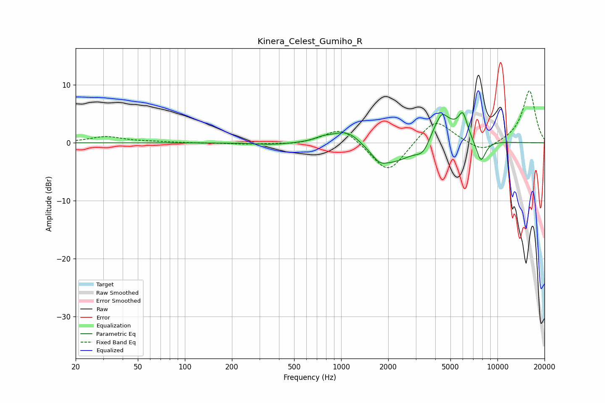

# Kinera_Celest_Gumiho_R
See [usage instructions](https://github.com/jaakkopasanen/AutoEq#usage) for more options and info.

### Parametric EQs
Apply preamp of -5.3 dB when using parametric equalizer.

|   # | Type    |   Fc (Hz) |    Q |   Gain (dB) |
|-----|---------|-----------|------|-------------|
|   1 | Peaking |       363 | 1.3  |        -0.3 |
|   2 | Peaking |       766 | 2.61 |         0.6 |
|   3 | Peaking |      1104 | 1.42 |         3   |
|   4 | Peaking |      1760 | 3.52 |        -1.1 |
|   5 | Peaking |      2113 | 0.9  |        -4.2 |
|   6 | Peaking |      3382 | 2.68 |        -3   |
|   7 | Peaking |      4298 | 1.38 |         5.7 |
|   8 | Peaking |      4412 | 5.18 |         1.2 |
|   9 | Peaking |      6009 | 4.88 |         3.7 |
|  10 | Peaking |      7827 | 4.19 |        -4   |

### Fixed Band EQs
When using fixed band (also called graphic) equalizer, apply preamp of **-9.1 dB** (if available) and set gains manually with these parameters.

|   # | Type    |   Fc (Hz) |    Q |   Gain (dB) |
|-----|---------|-----------|------|-------------|
|   1 | Peaking |        31 | 1.41 |         1.1 |
|   2 | Peaking |        62 | 1.41 |         0.2 |
|   3 | Peaking |       125 | 1.41 |        -0   |
|   4 | Peaking |       250 | 1.41 |        -0.2 |
|   5 | Peaking |       500 | 1.41 |        -0.3 |
|   6 | Peaking |      1000 | 1.41 |         2.9 |
|   7 | Peaking |      2000 | 1.41 |        -5.5 |
|   8 | Peaking |      4000 | 1.41 |         4.4 |
|   9 | Peaking |      8000 | 1.41 |        -1.8 |
|  10 | Peaking |     16000 | 1.41 |         9.1 |

### Graphs

