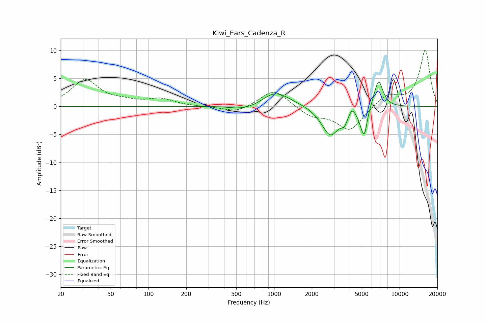

# Kiwi_Ears_Cadenza_R
See [usage instructions](https://github.com/jaakkopasanen/AutoEq#usage) for more options and info.

### Parametric EQs
Apply preamp of -4.4 dB when using parametric equalizer.

|   # | Type    |   Fc (Hz) |    Q |   Gain (dB) |
|-----|---------|-----------|------|-------------|
|   1 | Peaking |       516 | 1.69 |        -0.4 |
|   2 | Peaking |       684 | 1.21 |        -0.9 |
|   3 | Peaking |      1011 | 1.32 |         2.3 |
|   4 | Peaking |      1069 | 0.74 |         0.7 |
|   5 | Peaking |      2810 | 1.98 |        -5.3 |
|   6 | Peaking |      3628 | 5.59 |        -1.5 |
|   7 | Peaking |      4165 | 6    |         1.3 |
|   8 | Peaking |      4916 | 6    |        -1.2 |
|   9 | Peaking |      5246 | 5.97 |        -4.5 |
|  10 | Peaking |      6795 | 3.78 |         5   |

### Fixed Band EQs
When using fixed band (also called graphic) equalizer, apply preamp of **-10.2 dB** (if available) and set gains manually with these parameters.

|   # | Type    |   Fc (Hz) |    Q |   Gain (dB) |
|-----|---------|-----------|------|-------------|
|   1 | Peaking |        31 | 1.41 |         4.6 |
|   2 | Peaking |        62 | 1.41 |         0.6 |
|   3 | Peaking |       125 | 1.41 |         1.2 |
|   4 | Peaking |       250 | 1.41 |        -0.1 |
|   5 | Peaking |       500 | 1.41 |        -1.1 |
|   6 | Peaking |      1000 | 1.41 |         3.1 |
|   7 | Peaking |      2000 | 1.41 |        -1.7 |
|   8 | Peaking |      4000 | 1.41 |        -4.3 |
|   9 | Peaking |      8000 | 1.41 |         2.1 |
|  10 | Peaking |     16000 | 1.41 |        10.1 |

### Graphs

