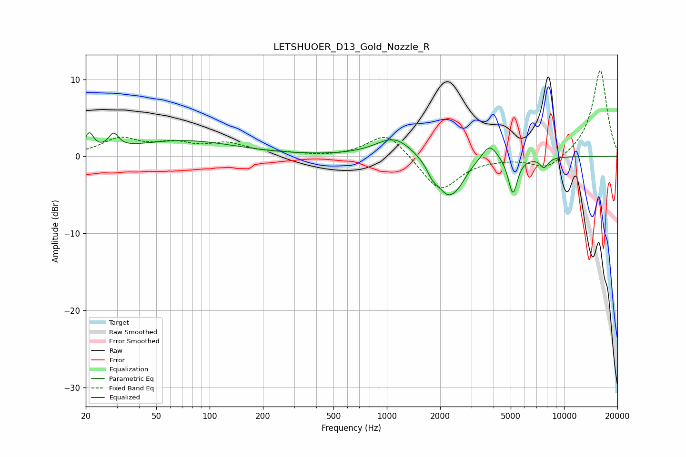

# LETSHUOER_D13_Gold_Nozzle_R
See [usage instructions](https://github.com/jaakkopasanen/AutoEq#usage) for more options and info.

### Parametric EQs
Apply preamp of -3.2 dB when using parametric equalizer.

|   # | Type    |   Fc (Hz) |    Q |   Gain (dB) |
|-----|---------|-----------|------|-------------|
|   1 | Peaking |        21 | 5.77 |         2.3 |
|   2 | Peaking |        29 | 5.13 |         1.9 |
|   3 | Peaking |        71 | 0.48 |         2   |
|   4 | Peaking |      1105 | 1.35 |         2.6 |
|   5 | Peaking |      1805 | 4.83 |        -1.1 |
|   6 | Peaking |      2213 | 2.04 |        -4.9 |
|   7 | Peaking |      2571 | 3.28 |        -0.9 |
|   8 | Peaking |      3804 | 3.25 |         2.2 |
|   9 | Peaking |      5144 | 5.41 |        -4.8 |
|  10 | Peaking |      7717 | 5.85 |        -1.3 |

### Fixed Band EQs
When using fixed band (also called graphic) equalizer, apply preamp of **-11.2 dB** (if available) and set gains manually with these parameters.

|   # | Type    |   Fc (Hz) |    Q |   Gain (dB) |
|-----|---------|-----------|------|-------------|
|   1 | Peaking |        31 | 1.41 |         2.2 |
|   2 | Peaking |        62 | 1.41 |         1.4 |
|   3 | Peaking |       125 | 1.41 |         1.5 |
|   4 | Peaking |       250 | 1.41 |         0.3 |
|   5 | Peaking |       500 | 1.41 |        -0.1 |
|   6 | Peaking |      1000 | 1.41 |         3.3 |
|   7 | Peaking |      2000 | 1.41 |        -4.6 |
|   8 | Peaking |      4000 | 1.41 |        -0.1 |
|   9 | Peaking |      8000 | 1.41 |        -1.8 |
|  10 | Peaking |     16000 | 1.41 |        11.3 |

### Graphs

