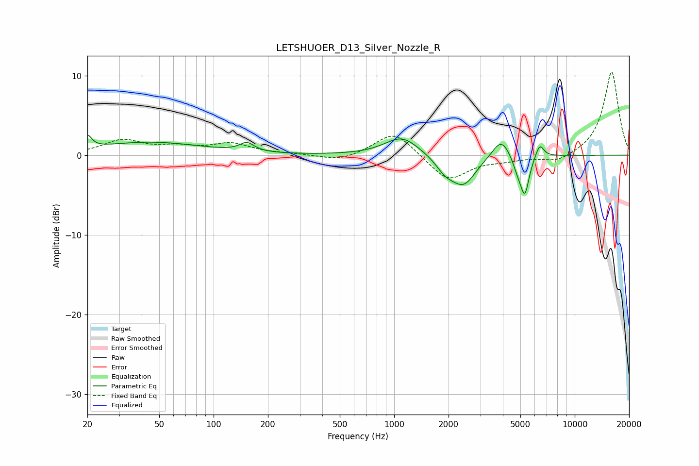

# LETSHUOER_D13_Silver_Nozzle_R
See [usage instructions](https://github.com/jaakkopasanen/AutoEq#usage) for more options and info.

### Parametric EQs
Apply preamp of -2.6 dB when using parametric equalizer.

|   # | Type    |   Fc (Hz) |    Q |   Gain (dB) |
|-----|---------|-----------|------|-------------|
|   1 | Peaking |        20 | 6    |         1.6 |
|   2 | Peaking |        44 | 0.49 |         1.6 |
|   3 | Peaking |       153 | 3.57 |         1.1 |
|   4 | Peaking |      1103 | 1.5  |         2.4 |
|   5 | Peaking |      1917 | 2.7  |        -1.5 |
|   6 | Peaking |      2424 | 2.07 |        -3.6 |
|   7 | Peaking |      3909 | 2.93 |         2.5 |
|   8 | Peaking |      4817 | 5.34 |        -1.4 |
|   9 | Peaking |      5290 | 5.76 |        -4.7 |
|  10 | Peaking |      6393 | 6    |         1.7 |

### Fixed Band EQs
When using fixed band (also called graphic) equalizer, apply preamp of **-10.5 dB** (if available) and set gains manually with these parameters.

|   # | Type    |   Fc (Hz) |    Q |   Gain (dB) |
|-----|---------|-----------|------|-------------|
|   1 | Peaking |        31 | 1.41 |         1.8 |
|   2 | Peaking |        62 | 1.41 |         0.8 |
|   3 | Peaking |       125 | 1.41 |         1.3 |
|   4 | Peaking |       250 | 1.41 |         0.1 |
|   5 | Peaking |       500 | 1.41 |        -0.8 |
|   6 | Peaking |      1000 | 1.41 |         3.1 |
|   7 | Peaking |      2000 | 1.41 |        -3.3 |
|   8 | Peaking |      4000 | 1.41 |        -0.5 |
|   9 | Peaking |      8000 | 1.41 |        -1   |
|  10 | Peaking |     16000 | 1.41 |        10.6 |

### Graphs

