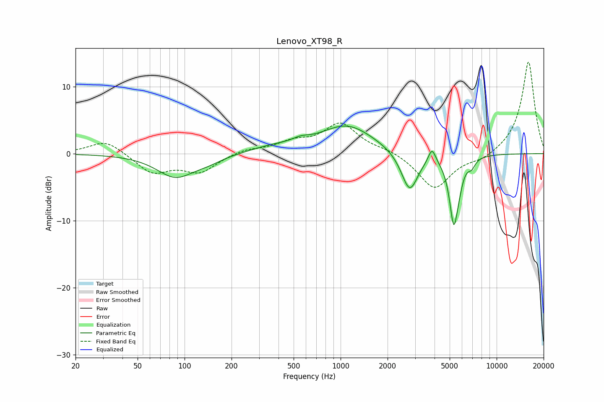

# Lenovo_XT98_R
See [usage instructions](https://github.com/jaakkopasanen/AutoEq#usage) for more options and info.

### Parametric EQs
Apply preamp of -4.2 dB when using parametric equalizer.

|   # | Type    |   Fc (Hz) |    Q |   Gain (dB) |
|-----|---------|-----------|------|-------------|
|   1 | Peaking |        87 | 1.19 |        -3.4 |
|   2 | Peaking |       142 | 1.46 |        -0.8 |
|   3 | Peaking |       366 | 0.92 |         0.8 |
|   4 | Peaking |       556 | 2.75 |         0.6 |
|   5 | Peaking |      1100 | 0.82 |         4.2 |
|   6 | Peaking |      2770 | 2.62 |        -6   |
|   7 | Peaking |      3852 | 6    |         2.2 |
|   8 | Peaking |      5317 | 4.88 |       -10   |
|   9 | Peaking |      5770 | 6    |        -1.2 |
|  10 | Peaking |      6912 | 6    |        -1.1 |

### Fixed Band EQs
When using fixed band (also called graphic) equalizer, apply preamp of **-13.8 dB** (if available) and set gains manually with these parameters.

|   # | Type    |   Fc (Hz) |    Q |   Gain (dB) |
|-----|---------|-----------|------|-------------|
|   1 | Peaking |        31 | 1.41 |         2.1 |
|   2 | Peaking |        62 | 1.41 |        -2.8 |
|   3 | Peaking |       125 | 1.41 |        -2.6 |
|   4 | Peaking |       250 | 1.41 |         0.7 |
|   5 | Peaking |       500 | 1.41 |         1.5 |
|   6 | Peaking |      1000 | 1.41 |         4.4 |
|   7 | Peaking |      2000 | 1.41 |         0.6 |
|   8 | Peaking |      4000 | 1.41 |        -5.3 |
|   9 | Peaking |      8000 | 1.41 |        -0.9 |
|  10 | Peaking |     16000 | 1.41 |        13.9 |

### Graphs

