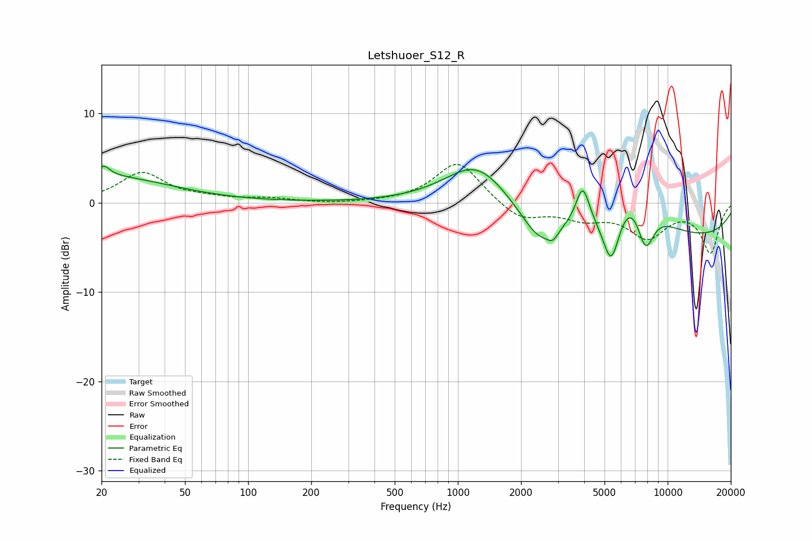

# Letshuoer_S12_R
See [usage instructions](https://github.com/jaakkopasanen/AutoEq#usage) for more options and info.

### Parametric EQs
Apply preamp of -4.2 dB when using parametric equalizer.

|   # | Type    |   Fc (Hz) |    Q |   Gain (dB) |
|-----|---------|-----------|------|-------------|
|   1 | Peaking |        20 | 0.45 |         3   |
|   2 | Peaking |        21 | 5.18 |         1.1 |
|   3 | Peaking |      1238 | 0.92 |         5.2 |
|   4 | Peaking |      2437 | 1.71 |        -3.2 |
|   5 | Peaking |      2837 | 5.63 |        -1   |
|   6 | Peaking |      3934 | 4.32 |         4.4 |
|   7 | Peaking |      5384 | 3.28 |        -6.3 |
|   8 | Peaking |      6897 | 1.12 |         6.7 |
|   9 | Peaking |      7824 | 2.99 |        -5.9 |
|  10 | Peaking |      9098 | 0.18 |        -4.3 |

### Fixed Band EQs
When using fixed band (also called graphic) equalizer, apply preamp of **-4.4 dB** (if available) and set gains manually with these parameters.

|   # | Type    |   Fc (Hz) |    Q |   Gain (dB) |
|-----|---------|-----------|------|-------------|
|   1 | Peaking |        31 | 1.41 |         3.3 |
|   2 | Peaking |        62 | 1.41 |         0.4 |
|   3 | Peaking |       125 | 1.41 |         0.4 |
|   4 | Peaking |       250 | 1.41 |        -0.1 |
|   5 | Peaking |       500 | 1.41 |         0   |
|   6 | Peaking |      1000 | 1.41 |         4.7 |
|   7 | Peaking |      2000 | 1.41 |        -2   |
|   8 | Peaking |      4000 | 1.41 |        -1.5 |
|   9 | Peaking |      8000 | 1.41 |        -3.6 |
|  10 | Peaking |     16000 | 1.41 |        -5.5 |

### Graphs

