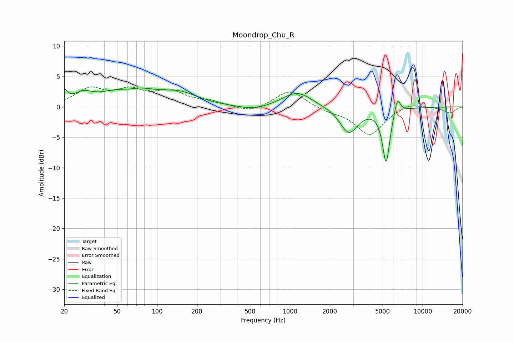

# Moondrop_Chu_R
See [usage instructions](https://github.com/jaakkopasanen/AutoEq#usage) for more options and info.

### Parametric EQs
Apply preamp of -3.2 dB when using parametric equalizer.

|   # | Type    |   Fc (Hz) |    Q |   Gain (dB) |
|-----|---------|-----------|------|-------------|
|   1 | Peaking |        20 | 5.99 |         1.8 |
|   2 | Peaking |        28 | 2.09 |         1.4 |
|   3 | Peaking |        60 | 2.05 |        -0.7 |
|   4 | Peaking |        62 | 0.75 |         3.2 |
|   5 | Peaking |       151 | 1.07 |         1.7 |
|   6 | Peaking |       538 | 1.23 |        -0.7 |
|   7 | Peaking |      1136 | 1.29 |         2.5 |
|   8 | Peaking |      2787 | 2.07 |        -4.3 |
|   9 | Peaking |      5314 | 4.9  |        -9   |
|  10 | Peaking |      6452 | 5.93 |         2.8 |

### Fixed Band EQs
When using fixed band (also called graphic) equalizer, apply preamp of **-3.4 dB** (if available) and set gains manually with these parameters.

|   # | Type    |   Fc (Hz) |    Q |   Gain (dB) |
|-----|---------|-----------|------|-------------|
|   1 | Peaking |        31 | 1.41 |         2.7 |
|   2 | Peaking |        62 | 1.41 |         2.3 |
|   3 | Peaking |       125 | 1.41 |         2.3 |
|   4 | Peaking |       250 | 1.41 |         0.8 |
|   5 | Peaking |       500 | 1.41 |        -1   |
|   6 | Peaking |      1000 | 1.41 |         2.8 |
|   7 | Peaking |      2000 | 1.41 |        -0.6 |
|   8 | Peaking |      4000 | 1.41 |        -4.6 |
|   9 | Peaking |      8000 | 1.41 |         0.8 |
|  10 | Peaking |     16000 | 1.41 |        -1   |

### Graphs

