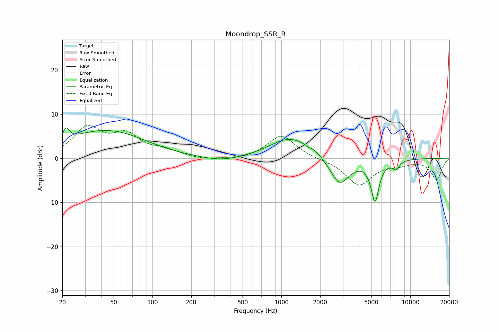

# Moondrop_SSR_R
See [usage instructions](https://github.com/jaakkopasanen/AutoEq#usage) for more options and info.

### Parametric EQs
Apply preamp of -7.0 dB when using parametric equalizer.

|   # | Type    |   Fc (Hz) |    Q |   Gain (dB) |
|-----|---------|-----------|------|-------------|
|   1 | Peaking |        21 | 5.89 |         2.7 |
|   2 | Peaking |        40 | 0.47 |         5.7 |
|   3 | Peaking |        65 | 0.73 |         0.8 |
|   4 | Peaking |       345 | 0.91 |        -1.1 |
|   5 | Peaking |      1144 | 0.92 |         4.5 |
|   6 | Peaking |      1620 | 5.71 |        -0.5 |
|   7 | Peaking |      1722 | 1.78 |         1.2 |
|   8 | Peaking |      2825 | 1.84 |        -6.4 |
|   9 | Peaking |      5328 | 4.44 |        -9.2 |
|  10 | Peaking |      7737 | 4.76 |        -1.9 |

### Fixed Band EQs
When using fixed band (also called graphic) equalizer, apply preamp of **-7.6 dB** (if available) and set gains manually with these parameters.

|   # | Type    |   Fc (Hz) |    Q |   Gain (dB) |
|-----|---------|-----------|------|-------------|
|   1 | Peaking |        31 | 1.41 |         6.5 |
|   2 | Peaking |        62 | 1.41 |         4.7 |
|   3 | Peaking |       125 | 1.41 |         1.5 |
|   4 | Peaking |       250 | 1.41 |        -0.5 |
|   5 | Peaking |       500 | 1.41 |        -0.4 |
|   6 | Peaking |      1000 | 1.41 |         5.3 |
|   7 | Peaking |      2000 | 1.41 |        -0.1 |
|   8 | Peaking |      4000 | 1.41 |        -6   |
|   9 | Peaking |      8000 | 1.41 |        -1.1 |
|  10 | Peaking |     16000 | 1.41 |        -4.8 |

### Graphs

