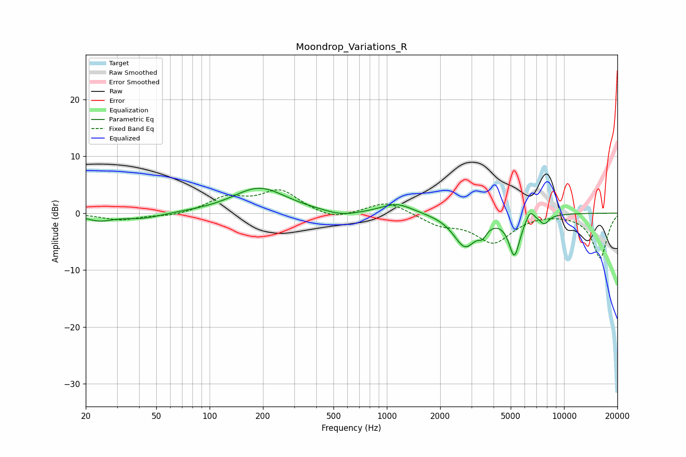

# Moondrop_Variations_R
See [usage instructions](https://github.com/jaakkopasanen/AutoEq#usage) for more options and info.

### Parametric EQs
Apply preamp of -4.5 dB when using parametric equalizer.

|   # | Type    |   Fc (Hz) |    Q |   Gain (dB) |
|-----|---------|-----------|------|-------------|
|   1 | Peaking |        24 | 1.85 |        -1.2 |
|   2 | Peaking |        42 | 1.32 |        -1   |
|   3 | Peaking |       191 | 0.94 |         4.4 |
|   4 | Peaking |       554 | 1.5  |        -0.9 |
|   5 | Peaking |      1138 | 1.6  |         1.8 |
|   6 | Peaking |      2762 | 2.16 |        -5.7 |
|   7 | Peaking |      3472 | 6    |        -1.5 |
|   8 | Peaking |      5245 | 4.42 |        -7   |
|   9 | Peaking |      6427 | 6    |         1.8 |
|  10 | Peaking |      7730 | 5.13 |        -1.5 |

### Fixed Band EQs
When using fixed band (also called graphic) equalizer, apply preamp of **-4.2 dB** (if available) and set gains manually with these parameters.

|   # | Type    |   Fc (Hz) |    Q |   Gain (dB) |
|-----|---------|-----------|------|-------------|
|   1 | Peaking |        31 | 1.41 |        -1.2 |
|   2 | Peaking |        62 | 1.41 |        -0.6 |
|   3 | Peaking |       125 | 1.41 |         2.6 |
|   4 | Peaking |       250 | 1.41 |         3.8 |
|   5 | Peaking |       500 | 1.41 |        -1.3 |
|   6 | Peaking |      1000 | 1.41 |         2.2 |
|   7 | Peaking |      2000 | 1.41 |        -1.9 |
|   8 | Peaking |      4000 | 1.41 |        -5   |
|   9 | Peaking |      8000 | 1.41 |         0.2 |
|  10 | Peaking |     16000 | 1.41 |        -7.9 |

### Graphs

