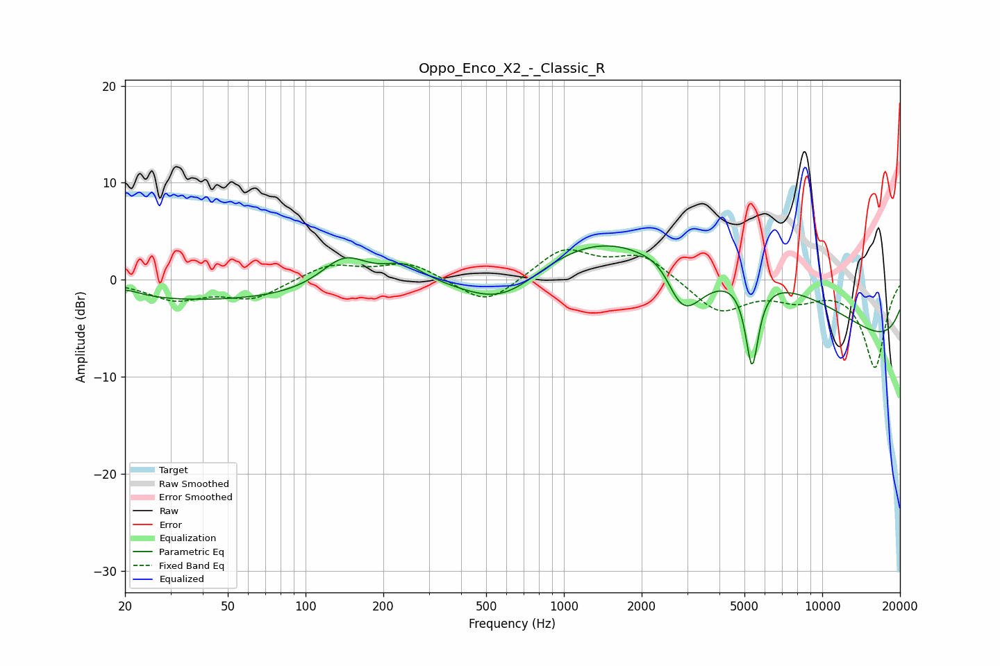

# Oppo_Enco_X2_-_Classic_R
See [usage instructions](https://github.com/jaakkopasanen/AutoEq#usage) for more options and info.

### Parametric EQs
Apply preamp of -3.6 dB when using parametric equalizer.

|   # | Type    |   Fc (Hz) |    Q |   Gain (dB) |
|-----|---------|-----------|------|-------------|
|   1 | Peaking |        20 | 2.22 |         0.8 |
|   2 | Peaking |        41 | 0.23 |        -2.2 |
|   3 | Peaking |       141 | 1.54 |         3.3 |
|   4 | Peaking |       239 | 1.78 |         1.8 |
|   5 | Peaking |       583 | 0.81 |        -5   |
|   6 | Peaking |      2449 | 1.98 |         2.7 |
|   7 | Peaking |      2832 | 1.55 |        -8.2 |
|   8 | Peaking |      3603 | 0.19 |        10.9 |
|   9 | Peaking |      5351 | 5.46 |        -8.9 |
|  10 | Peaking |     10000 | 0.18 |       -10.1 |

### Fixed Band EQs
When using fixed band (also called graphic) equalizer, apply preamp of **-3.2 dB** (if available) and set gains manually with these parameters.

|   # | Type    |   Fc (Hz) |    Q |   Gain (dB) |
|-----|---------|-----------|------|-------------|
|   1 | Peaking |        31 | 1.41 |        -1.9 |
|   2 | Peaking |        62 | 1.41 |        -1.9 |
|   3 | Peaking |       125 | 1.41 |         1.6 |
|   4 | Peaking |       250 | 1.41 |         1.7 |
|   5 | Peaking |       500 | 1.41 |        -2.8 |
|   6 | Peaking |      1000 | 1.41 |         3.2 |
|   7 | Peaking |      2000 | 1.41 |         2.6 |
|   8 | Peaking |      4000 | 1.41 |        -3.4 |
|   9 | Peaking |      8000 | 1.41 |        -1.7 |
|  10 | Peaking |     16000 | 1.41 |        -9   |

### Graphs

