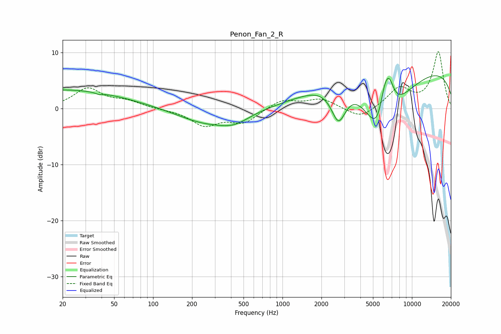

# Penon_Fan_2_R
See [usage instructions](https://github.com/jaakkopasanen/AutoEq#usage) for more options and info.

### Parametric EQs
Apply preamp of -5.9 dB when using parametric equalizer.

|   # | Type    |   Fc (Hz) |    Q |   Gain (dB) |
|-----|---------|-----------|------|-------------|
|   1 | Peaking |        20 | 0.28 |         3.4 |
|   2 | Peaking |        38 | 5.57 |        -0.3 |
|   3 | Peaking |       249 | 0.67 |        -2.4 |
|   4 | Peaking |       424 | 1.17 |        -1.8 |
|   5 | Peaking |      2712 | 2.33 |        -6.8 |
|   6 | Peaking |      3329 | 0.61 |         4.9 |
|   7 | Peaking |      5666 | 0.95 |       -16.3 |
|   8 | Peaking |      6089 | 3.39 |         5.4 |
|   9 | Peaking |      6643 | 3.16 |         5.8 |
|  10 | Peaking |      9806 | 0.18 |         7.9 |

### Fixed Band EQs
When using fixed band (also called graphic) equalizer, apply preamp of **-10.2 dB** (if available) and set gains manually with these parameters.

|   # | Type    |   Fc (Hz) |    Q |   Gain (dB) |
|-----|---------|-----------|------|-------------|
|   1 | Peaking |        31 | 1.41 |         3.5 |
|   2 | Peaking |        62 | 1.41 |         1.1 |
|   3 | Peaking |       125 | 1.41 |        -0.1 |
|   4 | Peaking |       250 | 1.41 |        -2.9 |
|   5 | Peaking |       500 | 1.41 |        -2.4 |
|   6 | Peaking |      1000 | 1.41 |         1.6 |
|   7 | Peaking |      2000 | 1.41 |         1.7 |
|   8 | Peaking |      4000 | 1.41 |        -2   |
|   9 | Peaking |      8000 | 1.41 |         3.5 |
|  10 | Peaking |     16000 | 1.41 |        10   |

### Graphs

