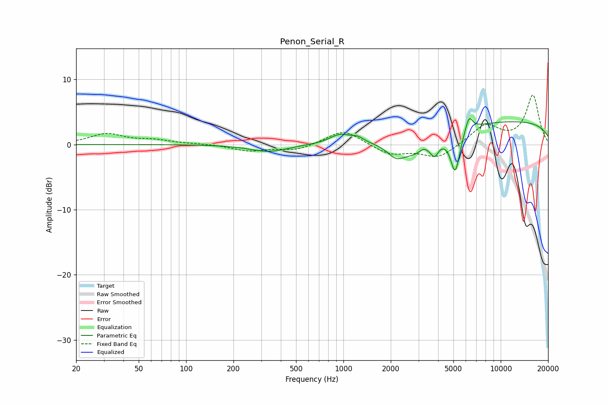

# Penon_Serial_R
See [usage instructions](https://github.com/jaakkopasanen/AutoEq#usage) for more options and info.

### Parametric EQs
Apply preamp of -4.1 dB when using parametric equalizer.

|   # | Type    |   Fc (Hz) |    Q |   Gain (dB) |
|-----|---------|-----------|------|-------------|
|   1 | Peaking |       336 | 1.17 |        -1.1 |
|   2 | Peaking |       952 | 2.2  |         1.4 |
|   3 | Peaking |      1230 | 3.62 |         0.7 |
|   4 | Peaking |      2148 | 2.86 |        -1.5 |
|   5 | Peaking |      2800 | 1.06 |        -3.4 |
|   6 | Peaking |      3238 | 6    |         0.5 |
|   7 | Peaking |      3792 | 5.79 |        -1.9 |
|   8 | Peaking |      5140 | 4.57 |        -6.3 |
|   9 | Peaking |      6281 | 5.82 |         2.4 |
|  10 | Peaking |     10000 | 0.18 |         3.7 |

### Fixed Band EQs
When using fixed band (also called graphic) equalizer, apply preamp of **-7.7 dB** (if available) and set gains manually with these parameters.

|   # | Type    |   Fc (Hz) |    Q |   Gain (dB) |
|-----|---------|-----------|------|-------------|
|   1 | Peaking |        31 | 1.41 |         1.6 |
|   2 | Peaking |        62 | 1.41 |         0.6 |
|   3 | Peaking |       125 | 1.41 |         0.1 |
|   4 | Peaking |       250 | 1.41 |        -1   |
|   5 | Peaking |       500 | 1.41 |        -0.9 |
|   6 | Peaking |      1000 | 1.41 |         2.3 |
|   7 | Peaking |      2000 | 1.41 |        -1.5 |
|   8 | Peaking |      4000 | 1.41 |        -2.1 |
|   9 | Peaking |      8000 | 1.41 |         3   |
|  10 | Peaking |     16000 | 1.41 |         7.5 |

### Graphs

