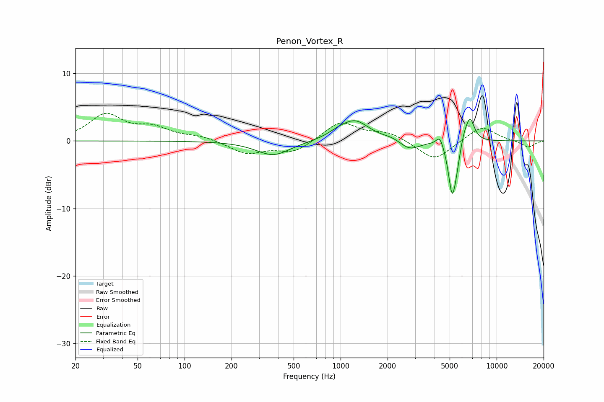

# Penon_Vortex_R
See [usage instructions](https://github.com/jaakkopasanen/AutoEq#usage) for more options and info.

### Parametric EQs
Apply preamp of -3.3 dB when using parametric equalizer.

|   # | Type    |   Fc (Hz) |    Q |   Gain (dB) |
|-----|---------|-----------|------|-------------|
|   1 | Peaking |       370 | 1.3  |        -2.2 |
|   2 | Peaking |       965 | 1.99 |         0.7 |
|   3 | Peaking |      1244 | 1.57 |         2.8 |
|   4 | Peaking |      2125 | 2.5  |         0.4 |
|   5 | Peaking |      2774 | 2.26 |        -1.4 |
|   6 | Peaking |      4329 | 6    |         1.6 |
|   7 | Peaking |      5188 | 5.61 |        -7.5 |
|   8 | Peaking |      5537 | 6    |        -1.8 |
|   9 | Peaking |      6194 | 6    |         1.2 |
|  10 | Peaking |      6758 | 4.76 |         3.5 |

### Fixed Band EQs
When using fixed band (also called graphic) equalizer, apply preamp of **-4.2 dB** (if available) and set gains manually with these parameters.

|   # | Type    |   Fc (Hz) |    Q |   Gain (dB) |
|-----|---------|-----------|------|-------------|
|   1 | Peaking |        31 | 1.41 |         3.8 |
|   2 | Peaking |        62 | 1.41 |         1.7 |
|   3 | Peaking |       125 | 1.41 |         0.6 |
|   4 | Peaking |       250 | 1.41 |        -1.9 |
|   5 | Peaking |       500 | 1.41 |        -1.7 |
|   6 | Peaking |      1000 | 1.41 |         2.9 |
|   7 | Peaking |      2000 | 1.41 |         1.2 |
|   8 | Peaking |      4000 | 1.41 |        -3   |
|   9 | Peaking |      8000 | 1.41 |         2.3 |
|  10 | Peaking |     16000 | 1.41 |        -1   |

### Graphs

