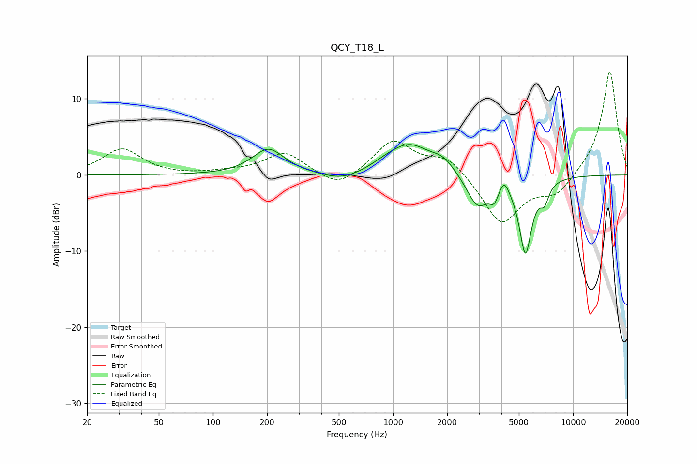

# QCY_T18_L
See [usage instructions](https://github.com/jaakkopasanen/AutoEq#usage) for more options and info.

### Parametric EQs
Apply preamp of -4.1 dB when using parametric equalizer.

|   # | Type    |   Fc (Hz) |    Q |   Gain (dB) |
|-----|---------|-----------|------|-------------|
|   1 | Peaking |       203 | 1.62 |         3.4 |
|   2 | Peaking |       520 | 1.35 |        -1.1 |
|   3 | Peaking |       897 | 2.16 |         0.4 |
|   4 | Peaking |      1224 | 1.21 |         3.9 |
|   5 | Peaking |      1898 | 2.17 |         1.5 |
|   6 | Peaking |      2949 | 2.28 |        -4.3 |
|   7 | Peaking |      3650 | 5.42 |        -1.8 |
|   8 | Peaking |      4134 | 5.31 |         1.8 |
|   9 | Peaking |      5437 | 3.93 |       -10   |
|  10 | Peaking |      6927 | 5.5  |        -2.2 |

### Fixed Band EQs
When using fixed band (also called graphic) equalizer, apply preamp of **-13.7 dB** (if available) and set gains manually with these parameters.

|   # | Type    |   Fc (Hz) |    Q |   Gain (dB) |
|-----|---------|-----------|------|-------------|
|   1 | Peaking |        31 | 1.41 |         3.4 |
|   2 | Peaking |        62 | 1.41 |        -0.1 |
|   3 | Peaking |       125 | 1.41 |         0.3 |
|   4 | Peaking |       250 | 1.41 |         2.9 |
|   5 | Peaking |       500 | 1.41 |        -2   |
|   6 | Peaking |      1000 | 1.41 |         4.5 |
|   7 | Peaking |      2000 | 1.41 |         2.4 |
|   8 | Peaking |      4000 | 1.41 |        -6.5 |
|   9 | Peaking |      8000 | 1.41 |        -2.6 |
|  10 | Peaking |     16000 | 1.41 |        13.9 |

### Graphs

