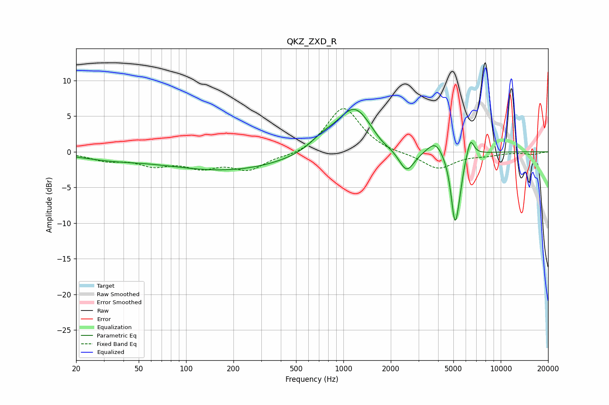

# QKZ_ZXD_R
See [usage instructions](https://github.com/jaakkopasanen/AutoEq#usage) for more options and info.

### Parametric EQs
Apply preamp of -6.0 dB when using parametric equalizer.

|   # | Type    |   Fc (Hz) |    Q |   Gain (dB) |
|-----|---------|-----------|------|-------------|
|   1 | Peaking |        33 | 0.7  |        -0.8 |
|   2 | Peaking |       184 | 0.36 |        -2.6 |
|   3 | Peaking |       731 | 1.85 |         1.2 |
|   4 | Peaking |      1178 | 1.22 |         6.5 |
|   5 | Peaking |      1746 | 2.22 |        -0.9 |
|   6 | Peaking |      2520 | 2.72 |        -3.5 |
|   7 | Peaking |      3846 | 2.91 |         1.8 |
|   8 | Peaking |      5112 | 5.36 |        -9.2 |
|   9 | Peaking |      5441 | 6    |        -2   |
|  10 | Peaking |      6419 | 5.95 |         2.6 |

### Fixed Band EQs
When using fixed band (also called graphic) equalizer, apply preamp of **-6.2 dB** (if available) and set gains manually with these parameters.

|   # | Type    |   Fc (Hz) |    Q |   Gain (dB) |
|-----|---------|-----------|------|-------------|
|   1 | Peaking |        31 | 1.41 |        -1.1 |
|   2 | Peaking |        62 | 1.41 |        -1.6 |
|   3 | Peaking |       125 | 1.41 |        -1.8 |
|   4 | Peaking |       250 | 1.41 |        -2.3 |
|   5 | Peaking |       500 | 1.41 |        -0.7 |
|   6 | Peaking |      1000 | 1.41 |         6.4 |
|   7 | Peaking |      2000 | 1.41 |        -0.2 |
|   8 | Peaking |      4000 | 1.41 |        -2.4 |
|   9 | Peaking |      8000 | 1.41 |        -0.4 |
|  10 | Peaking |     16000 | 1.41 |        -0.3 |

### Graphs

