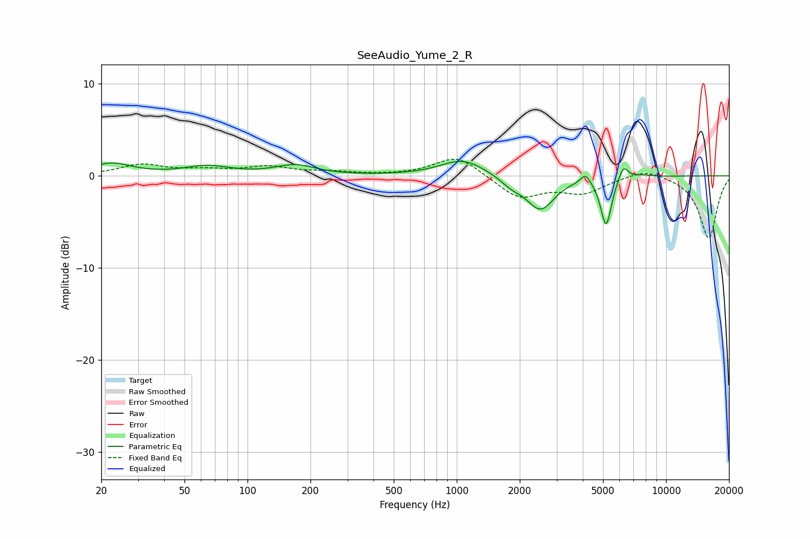

# SeeAudio_Yume_2_R
See [usage instructions](https://github.com/jaakkopasanen/AutoEq#usage) for more options and info.

### Parametric EQs
Apply preamp of -1.7 dB when using parametric equalizer.

|   # | Type    |   Fc (Hz) |    Q |   Gain (dB) |
|-----|---------|-----------|------|-------------|
|   1 | Peaking |        22 | 1.44 |         1.3 |
|   2 | Peaking |        64 | 1.28 |         1   |
|   3 | Peaking |       169 | 1.48 |         1.1 |
|   4 | Peaking |      1069 | 1.33 |         1.8 |
|   5 | Peaking |      1826 | 2.68 |        -0.8 |
|   6 | Peaking |      2511 | 2.12 |        -3.6 |
|   7 | Peaking |      4124 | 6    |         1.1 |
|   8 | Peaking |      5171 | 5.48 |        -5.3 |
|   9 | Peaking |      6262 | 6    |         1.6 |
|  10 | Peaking |      7780 | 3.36 |         0.2 |

### Fixed Band EQs
When using fixed band (also called graphic) equalizer, apply preamp of **-1.9 dB** (if available) and set gains manually with these parameters.

|   # | Type    |   Fc (Hz) |    Q |   Gain (dB) |
|-----|---------|-----------|------|-------------|
|   1 | Peaking |        31 | 1.41 |         1.2 |
|   2 | Peaking |        62 | 1.41 |         0.5 |
|   3 | Peaking |       125 | 1.41 |         0.9 |
|   4 | Peaking |       250 | 1.41 |         0.3 |
|   5 | Peaking |       500 | 1.41 |         0   |
|   6 | Peaking |      1000 | 1.41 |         2.2 |
|   7 | Peaking |      2000 | 1.41 |        -2.4 |
|   8 | Peaking |      4000 | 1.41 |        -1.7 |
|   9 | Peaking |      8000 | 1.41 |         0.9 |
|  10 | Peaking |     16000 | 1.41 |        -6.8 |

### Graphs

