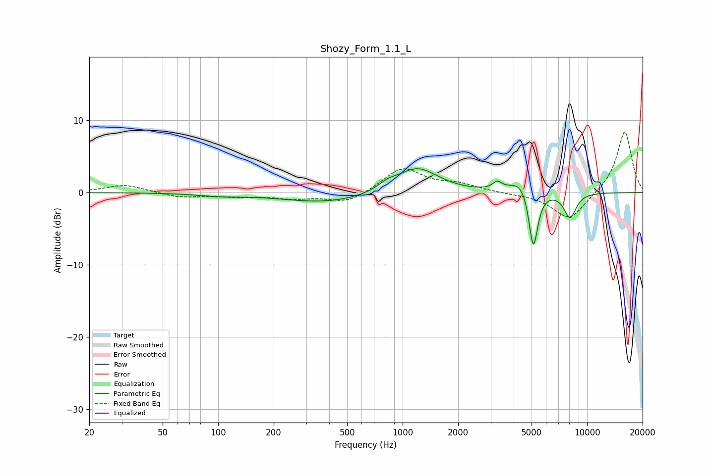

# Shozy_Form_1.1_L
See [usage instructions](https://github.com/jaakkopasanen/AutoEq#usage) for more options and info.

### Parametric EQs
Apply preamp of -3.4 dB when using parametric equalizer.

|   # | Type    |   Fc (Hz) |    Q |   Gain (dB) |
|-----|---------|-----------|------|-------------|
|   1 | Peaking |       102 | 1.19 |        -0.3 |
|   2 | Peaking |       387 | 0.6  |        -1.4 |
|   3 | Peaking |       830 | 2.86 |         0.8 |
|   4 | Peaking |      1191 | 1.29 |         3.3 |
|   5 | Peaking |      1402 | 1.24 |         0.2 |
|   6 | Peaking |      3262 | 6    |         1   |
|   7 | Peaking |      4439 | 2.27 |         2.1 |
|   8 | Peaking |      5107 | 6    |        -7   |
|   9 | Peaking |      5135 | 4.16 |        -1.6 |
|  10 | Peaking |      8086 | 3.98 |        -3.5 |

### Fixed Band EQs
When using fixed band (also called graphic) equalizer, apply preamp of **-8.5 dB** (if available) and set gains manually with these parameters.

|   # | Type    |   Fc (Hz) |    Q |   Gain (dB) |
|-----|---------|-----------|------|-------------|
|   1 | Peaking |        31 | 1.41 |         1.1 |
|   2 | Peaking |        62 | 1.41 |        -0.7 |
|   3 | Peaking |       125 | 1.41 |        -0.5 |
|   4 | Peaking |       250 | 1.41 |        -0.7 |
|   5 | Peaking |       500 | 1.41 |        -1.5 |
|   6 | Peaking |      1000 | 1.41 |         3.4 |
|   7 | Peaking |      2000 | 1.41 |         1   |
|   8 | Peaking |      4000 | 1.41 |        -0.1 |
|   9 | Peaking |      8000 | 1.41 |        -3.8 |
|  10 | Peaking |     16000 | 1.41 |         8.6 |

### Graphs

