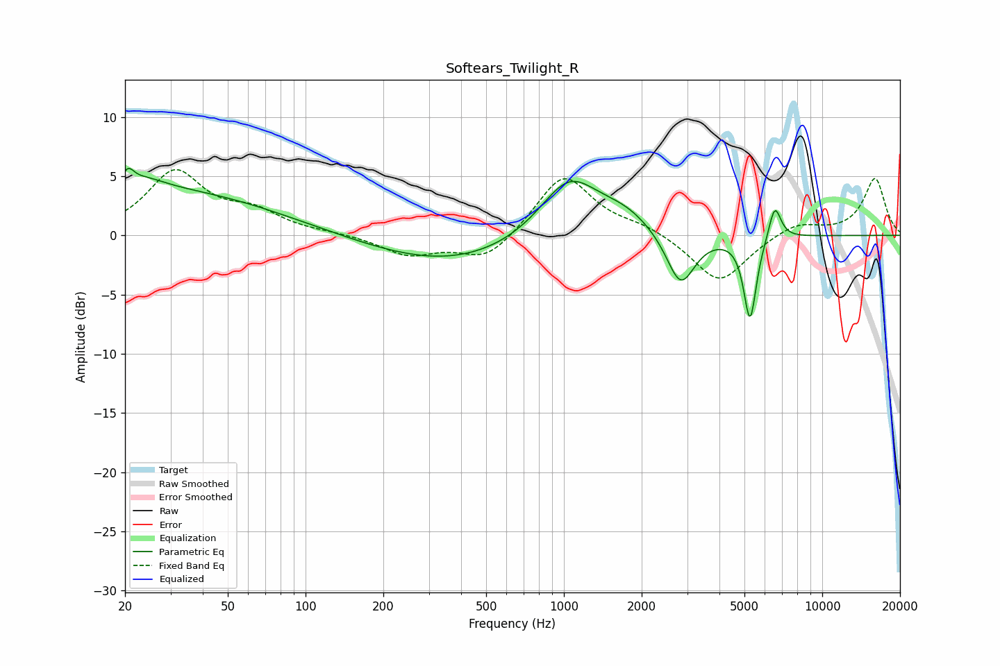

# Softears_Twilight_R
See [usage instructions](https://github.com/jaakkopasanen/AutoEq#usage) for more options and info.

### Parametric EQs
Apply preamp of -5.8 dB when using parametric equalizer.

|   # | Type    |   Fc (Hz) |    Q |   Gain (dB) |
|-----|---------|-----------|------|-------------|
|   1 | Peaking |        20 | 6    |        -1.9 |
|   2 | Peaking |        20 | 5.99 |         3.1 |
|   3 | Peaking |        24 | 1.73 |         1   |
|   4 | Peaking |        28 | 0.33 |         3.7 |
|   5 | Peaking |       364 | 0.45 |        -2.5 |
|   6 | Peaking |      1047 | 1.21 |         5.1 |
|   7 | Peaking |      1727 | 1.33 |         1.5 |
|   8 | Peaking |      2830 | 2.58 |        -4.6 |
|   9 | Peaking |      5256 | 5.68 |        -7.1 |
|  10 | Peaking |      6551 | 5.75 |         3   |

### Fixed Band EQs
When using fixed band (also called graphic) equalizer, apply preamp of **-5.6 dB** (if available) and set gains manually with these parameters.

|   # | Type    |   Fc (Hz) |    Q |   Gain (dB) |
|-----|---------|-----------|------|-------------|
|   1 | Peaking |        31 | 1.41 |         5.2 |
|   2 | Peaking |        62 | 1.41 |         1.7 |
|   3 | Peaking |       125 | 1.41 |         0.1 |
|   4 | Peaking |       250 | 1.41 |        -1.6 |
|   5 | Peaking |       500 | 1.41 |        -2.2 |
|   6 | Peaking |      1000 | 1.41 |         5.2 |
|   7 | Peaking |      2000 | 1.41 |         0.7 |
|   8 | Peaking |      4000 | 1.41 |        -4.1 |
|   9 | Peaking |      8000 | 1.41 |         1.1 |
|  10 | Peaking |     16000 | 1.41 |         4.8 |

### Graphs

