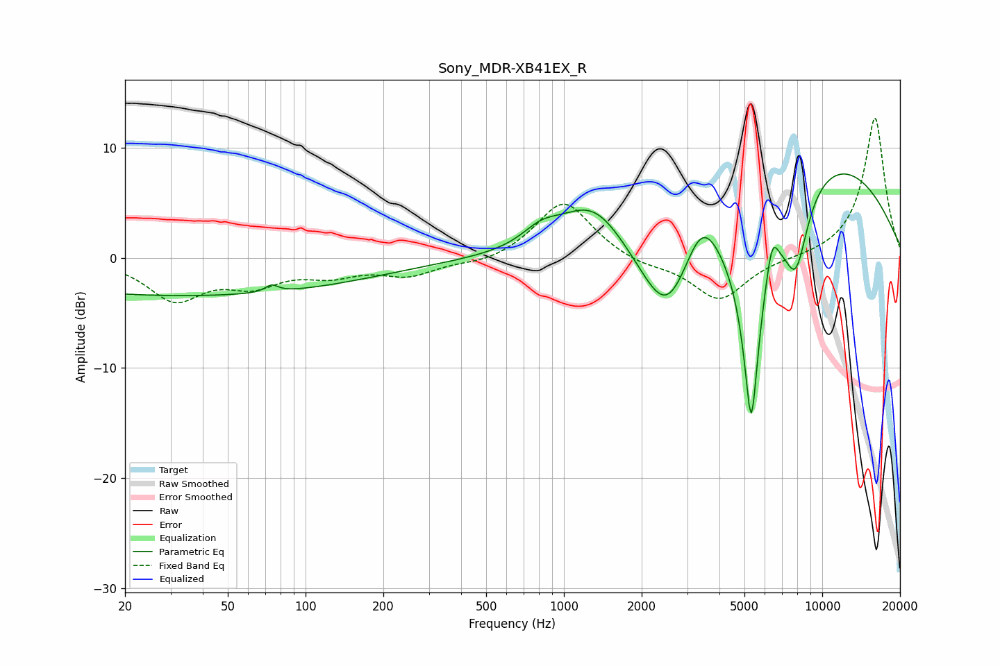

# Sony_MDR-XB41EX_R
See [usage instructions](https://github.com/jaakkopasanen/AutoEq#usage) for more options and info.

### Parametric EQs
Apply preamp of -7.7 dB when using parametric equalizer.

|   # | Type    |   Fc (Hz) |    Q |   Gain (dB) |
|-----|---------|-----------|------|-------------|
|   1 | Peaking |        34 | 0.18 |        -3.4 |
|   2 | Peaking |        74 | 5.87 |         0.7 |
|   3 | Peaking |       815 | 1.96 |         1.4 |
|   4 | Peaking |      1296 | 1.06 |         5   |
|   5 | Peaking |      2518 | 1.27 |        -8.3 |
|   6 | Peaking |      3404 | 1.96 |         4.7 |
|   7 | Peaking |      5312 | 3.49 |       -20   |
|   8 | Peaking |      6392 | 6    |         3   |
|   9 | Peaking |      7906 | 2.73 |        -6.9 |
|  10 | Peaking |     10000 | 0.35 |         9.2 |

### Fixed Band EQs
When using fixed band (also called graphic) equalizer, apply preamp of **-12.8 dB** (if available) and set gains manually with these parameters.

|   # | Type    |   Fc (Hz) |    Q |   Gain (dB) |
|-----|---------|-----------|------|-------------|
|   1 | Peaking |        31 | 1.41 |        -3.6 |
|   2 | Peaking |        62 | 1.41 |        -2.1 |
|   3 | Peaking |       125 | 1.41 |        -1.3 |
|   4 | Peaking |       250 | 1.41 |        -1.5 |
|   5 | Peaking |       500 | 1.41 |        -0.6 |
|   6 | Peaking |      1000 | 1.41 |         5.3 |
|   7 | Peaking |      2000 | 1.41 |        -0.7 |
|   8 | Peaking |      4000 | 1.41 |        -3.9 |
|   9 | Peaking |      8000 | 1.41 |        -0.1 |
|  10 | Peaking |     16000 | 1.41 |        12.8 |

### Graphs

