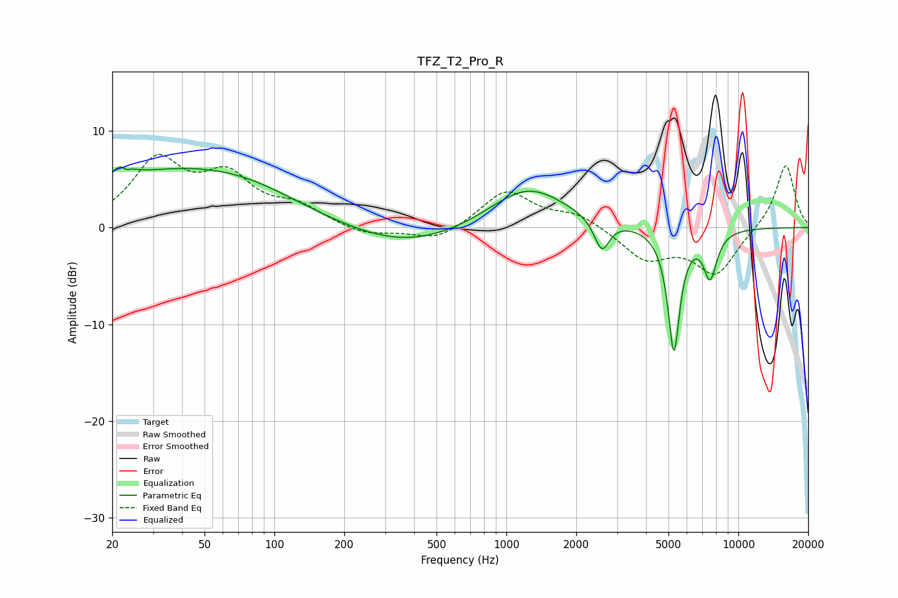

# TFZ_T2_Pro_R
See [usage instructions](https://github.com/jaakkopasanen/AutoEq#usage) for more options and info.

### Parametric EQs
Apply preamp of -6.4 dB when using parametric equalizer.

|   # | Type    |   Fc (Hz) |    Q |   Gain (dB) |
|-----|---------|-----------|------|-------------|
|   1 | Peaking |        22 | 4.76 |         4   |
|   2 | Peaking |        23 | 5.94 |        -3   |
|   3 | Peaking |        35 | 0.34 |         5.3 |
|   4 | Peaking |        78 | 0.59 |         1.4 |
|   5 | Peaking |       370 | 0.55 |        -2.2 |
|   6 | Peaking |      1238 | 0.85 |         4.4 |
|   7 | Peaking |      2578 | 4.34 |        -3.3 |
|   8 | Peaking |      5273 | 5.27 |       -12.8 |
|   9 | Peaking |      7327 | 4.37 |         0.7 |
|  10 | Peaking |      7535 | 4.45 |        -5.4 |

### Fixed Band EQs
When using fixed band (also called graphic) equalizer, apply preamp of **-7.6 dB** (if available) and set gains manually with these parameters.

|   # | Type    |   Fc (Hz) |    Q |   Gain (dB) |
|-----|---------|-----------|------|-------------|
|   1 | Peaking |        31 | 1.41 |         6.6 |
|   2 | Peaking |        62 | 1.41 |         4.7 |
|   3 | Peaking |       125 | 1.41 |         1.9 |
|   4 | Peaking |       250 | 1.41 |        -0.9 |
|   5 | Peaking |       500 | 1.41 |        -1.4 |
|   6 | Peaking |      1000 | 1.41 |         3.8 |
|   7 | Peaking |      2000 | 1.41 |         1.4 |
|   8 | Peaking |      4000 | 1.41 |        -3.1 |
|   9 | Peaking |      8000 | 1.41 |        -4.7 |
|  10 | Peaking |     16000 | 1.41 |         6.7 |

### Graphs

