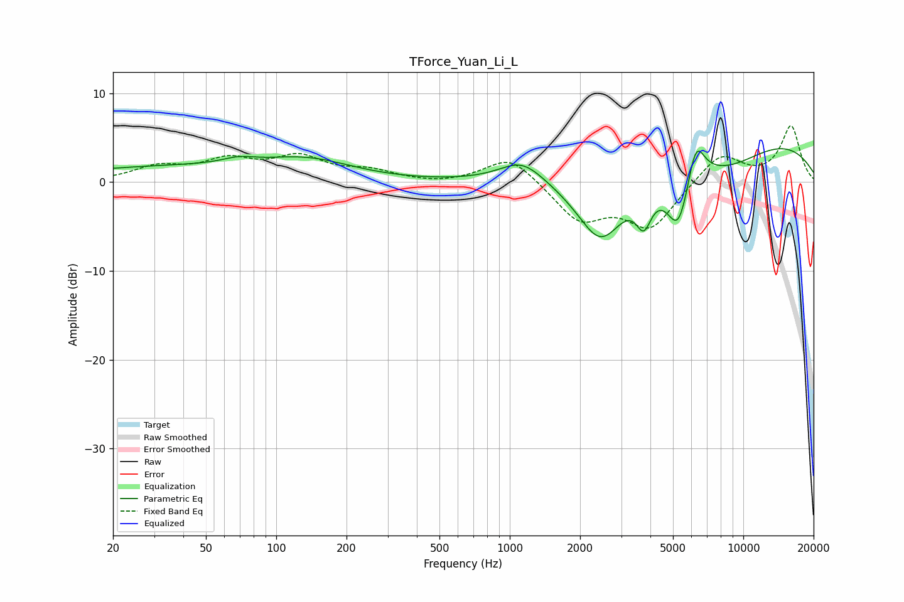

# TForce_Yuan_Li_L
See [usage instructions](https://github.com/jaakkopasanen/AutoEq#usage) for more options and info.

### Parametric EQs
Apply preamp of -3.9 dB when using parametric equalizer.

|   # | Type    |   Fc (Hz) |    Q |   Gain (dB) |
|-----|---------|-----------|------|-------------|
|   1 | Peaking |        34 | 0.3  |         1.6 |
|   2 | Peaking |        69 | 2.11 |         0.6 |
|   3 | Peaking |       138 | 0.74 |         2   |
|   4 | Peaking |      1127 | 1.48 |         2.6 |
|   5 | Peaking |      2455 | 1.33 |        -8   |
|   6 | Peaking |      3750 | 4.21 |        -3.9 |
|   7 | Peaking |      5283 | 2.64 |        -7.1 |
|   8 | Peaking |      6258 | 3.66 |         4.9 |
|   9 | Peaking |      8541 | 0.75 |        -3   |
|  10 | Peaking |      9903 | 0.25 |         5.5 |

### Fixed Band EQs
When using fixed band (also called graphic) equalizer, apply preamp of **-6.4 dB** (if available) and set gains manually with these parameters.

|   # | Type    |   Fc (Hz) |    Q |   Gain (dB) |
|-----|---------|-----------|------|-------------|
|   1 | Peaking |        31 | 1.41 |         1.6 |
|   2 | Peaking |        62 | 1.41 |         2.2 |
|   3 | Peaking |       125 | 1.41 |         2.6 |
|   4 | Peaking |       250 | 1.41 |         1.1 |
|   5 | Peaking |       500 | 1.41 |        -0.3 |
|   6 | Peaking |      1000 | 1.41 |         3.1 |
|   7 | Peaking |      2000 | 1.41 |        -4.2 |
|   8 | Peaking |      4000 | 1.41 |        -5   |
|   9 | Peaking |      8000 | 1.41 |         3.3 |
|  10 | Peaking |     16000 | 1.41 |         6.3 |

### Graphs

