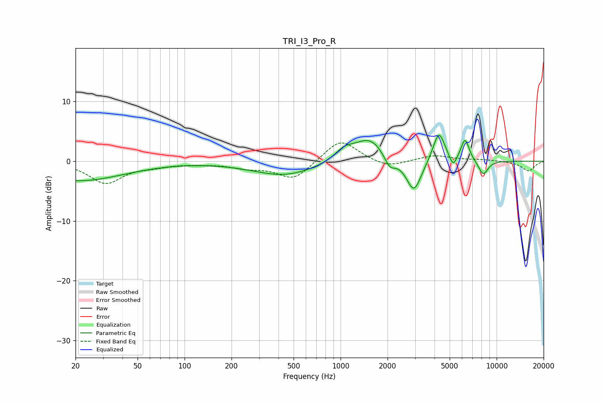

# TRI_I3_Pro_R
See [usage instructions](https://github.com/jaakkopasanen/AutoEq#usage) for more options and info.

### Parametric EQs
Apply preamp of -4.4 dB when using parametric equalizer.

|   # | Type    |   Fc (Hz) |    Q |   Gain (dB) |
|-----|---------|-----------|------|-------------|
|   1 | Peaking |        21 | 0.49 |        -3.3 |
|   2 | Peaking |       436 | 0.7  |        -2.4 |
|   3 | Peaking |      1059 | 2.26 |         1.7 |
|   4 | Peaking |      1540 | 1.43 |         3.9 |
|   5 | Peaking |      2066 | 3.87 |        -2.2 |
|   6 | Peaking |      2949 | 2.88 |        -5.6 |
|   7 | Peaking |      4266 | 3.67 |         5.2 |
|   8 | Peaking |      5260 | 5.99 |        -2   |
|   9 | Peaking |      6276 | 5.14 |         3.7 |
|  10 | Peaking |      8208 | 4.29 |        -2.4 |

### Fixed Band EQs
When using fixed band (also called graphic) equalizer, apply preamp of **-3.1 dB** (if available) and set gains manually with these parameters.

|   # | Type    |   Fc (Hz) |    Q |   Gain (dB) |
|-----|---------|-----------|------|-------------|
|   1 | Peaking |        31 | 1.41 |        -3.6 |
|   2 | Peaking |        62 | 1.41 |        -0.6 |
|   3 | Peaking |       125 | 1.41 |        -0.3 |
|   4 | Peaking |       250 | 1.41 |        -0.9 |
|   5 | Peaking |       500 | 1.41 |        -3.1 |
|   6 | Peaking |      1000 | 1.41 |         3.8 |
|   7 | Peaking |      2000 | 1.41 |        -1.2 |
|   8 | Peaking |      4000 | 1.41 |         1   |
|   9 | Peaking |      8000 | 1.41 |         0.2 |
|  10 | Peaking |     16000 | 1.41 |        -1.6 |

### Graphs

