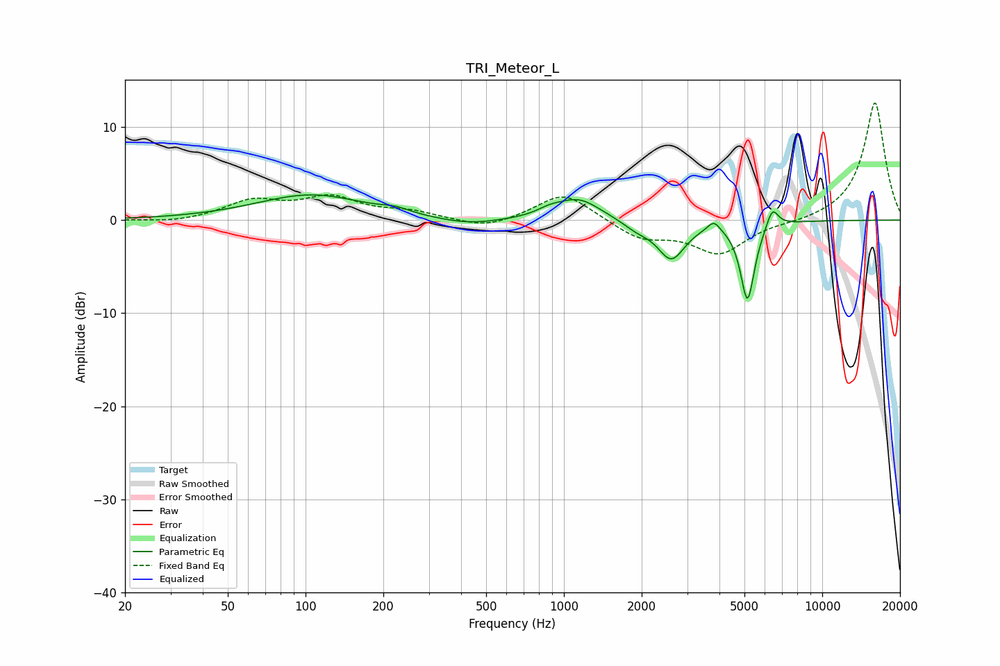

# TRI_Meteor_L
See [usage instructions](https://github.com/jaakkopasanen/AutoEq#usage) for more options and info.

### Parametric EQs
Apply preamp of -2.8 dB when using parametric equalizer.

|   # | Type    |   Fc (Hz) |    Q |   Gain (dB) |
|-----|---------|-----------|------|-------------|
|   1 | Peaking |       105 | 0.67 |         2.7 |
|   2 | Peaking |       223 | 2.74 |         0.4 |
|   3 | Peaking |       425 | 1.15 |        -0.7 |
|   4 | Peaking |       878 | 3.01 |         0.5 |
|   5 | Peaking |      1138 | 1.63 |         2.3 |
|   6 | Peaking |      1924 | 2.54 |        -0.9 |
|   7 | Peaking |      2605 | 2.66 |        -4   |
|   8 | Peaking |      3804 | 6    |         1.1 |
|   9 | Peaking |      5136 | 5.06 |        -8.5 |
|  10 | Peaking |      6413 | 6    |         2.2 |

### Fixed Band EQs
When using fixed band (also called graphic) equalizer, apply preamp of **-12.7 dB** (if available) and set gains manually with these parameters.

|   # | Type    |   Fc (Hz) |    Q |   Gain (dB) |
|-----|---------|-----------|------|-------------|
|   1 | Peaking |        31 | 1.41 |        -0.3 |
|   2 | Peaking |        62 | 1.41 |         2   |
|   3 | Peaking |       125 | 1.41 |         2.2 |
|   4 | Peaking |       250 | 1.41 |         0.8 |
|   5 | Peaking |       500 | 1.41 |        -1   |
|   6 | Peaking |      1000 | 1.41 |         3.1 |
|   7 | Peaking |      2000 | 1.41 |        -1.9 |
|   8 | Peaking |      4000 | 1.41 |        -3.5 |
|   9 | Peaking |      8000 | 1.41 |        -0.3 |
|  10 | Peaking |     16000 | 1.41 |        12.7 |

### Graphs

