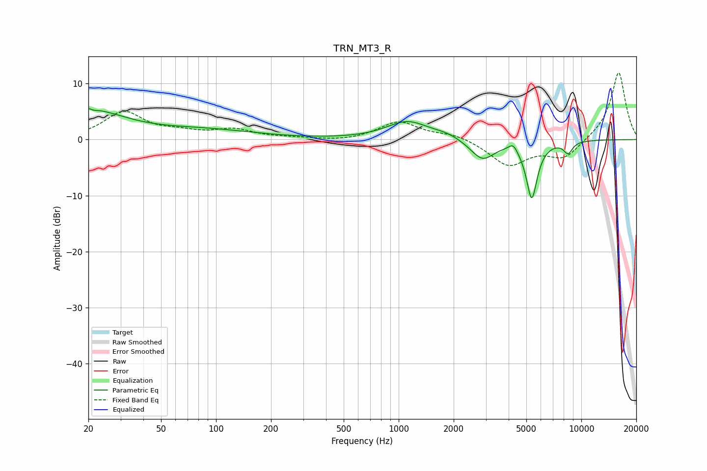

# TRN_MT3_R
See [usage instructions](https://github.com/jaakkopasanen/AutoEq#usage) for more options and info.

### Parametric EQs
Apply preamp of -5.6 dB when using parametric equalizer.

|   # | Type    |   Fc (Hz) |    Q |   Gain (dB) |
|-----|---------|-----------|------|-------------|
|   1 | Peaking |        20 | 0.72 |         5   |
|   2 | Peaking |        21 | 5.87 |         3.3 |
|   3 | Peaking |        21 | 5.98 |        -3.2 |
|   4 | Peaking |        87 | 0.49 |         1.6 |
|   5 | Peaking |      1117 | 1.23 |         3.2 |
|   6 | Peaking |      1826 | 1.93 |         0.7 |
|   7 | Peaking |      2875 | 2.14 |        -3.6 |
|   8 | Peaking |      4235 | 6    |         1.3 |
|   9 | Peaking |      5354 | 4.5  |       -10.3 |
|  10 | Peaking |      8462 | 5.34 |        -2   |

### Fixed Band EQs
When using fixed band (also called graphic) equalizer, apply preamp of **-12.0 dB** (if available) and set gains manually with these parameters.

|   # | Type    |   Fc (Hz) |    Q |   Gain (dB) |
|-----|---------|-----------|------|-------------|
|   1 | Peaking |        31 | 1.41 |         4.8 |
|   2 | Peaking |        62 | 1.41 |         1   |
|   3 | Peaking |       125 | 1.41 |         1.6 |
|   4 | Peaking |       250 | 1.41 |         0.2 |
|   5 | Peaking |       500 | 1.41 |        -0.4 |
|   6 | Peaking |      1000 | 1.41 |         3.2 |
|   7 | Peaking |      2000 | 1.41 |         1   |
|   8 | Peaking |      4000 | 1.41 |        -4.6 |
|   9 | Peaking |      8000 | 1.41 |        -3.3 |
|  10 | Peaking |     16000 | 1.41 |        12.2 |

### Graphs

