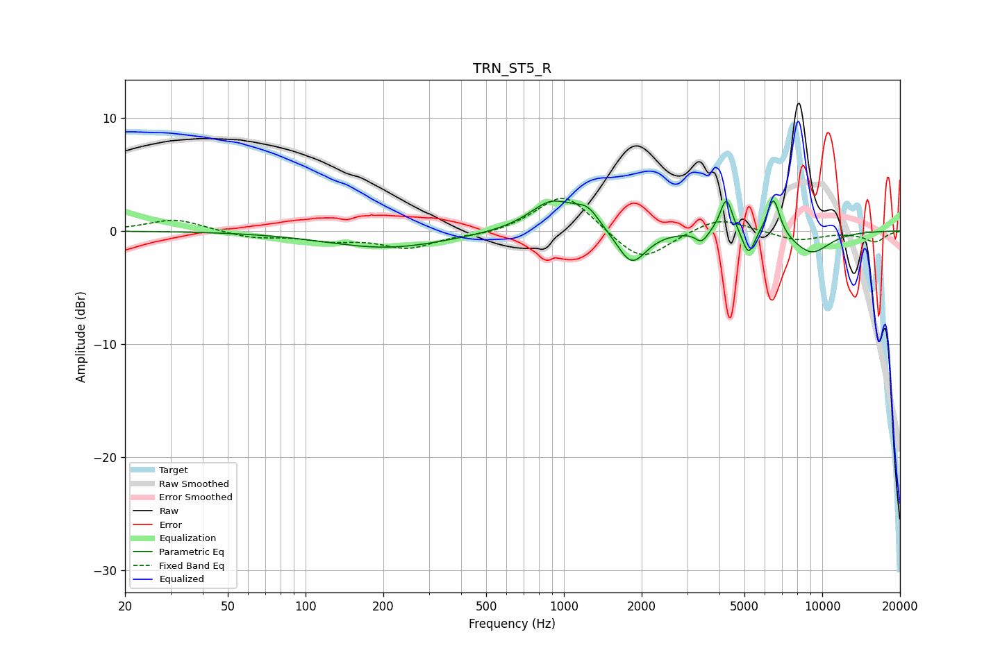

# TRN_ST5_R
See [usage instructions](https://github.com/jaakkopasanen/AutoEq#usage) for more options and info.

### Parametric EQs
Apply preamp of -2.8 dB when using parametric equalizer.

|   # | Type    |   Fc (Hz) |    Q |   Gain (dB) |
|-----|---------|-----------|------|-------------|
|   1 | Peaking |       207 | 0.6  |        -1.5 |
|   2 | Peaking |       917 | 1.59 |         3   |
|   3 | Peaking |       958 | 3.3  |        -0.2 |
|   4 | Peaking |      1239 | 3.12 |         1.3 |
|   5 | Peaking |      1829 | 2.51 |        -3.2 |
|   6 | Peaking |      3416 | 6    |        -1   |
|   7 | Peaking |      4256 | 5.93 |         3.1 |
|   8 | Peaking |      5185 | 6    |        -2.2 |
|   9 | Peaking |      6470 | 5.57 |         3.4 |
|  10 | Peaking |      9079 | 1.72 |        -2   |

### Fixed Band EQs
When using fixed band (also called graphic) equalizer, apply preamp of **-3.0 dB** (if available) and set gains manually with these parameters.

|   # | Type    |   Fc (Hz) |    Q |   Gain (dB) |
|-----|---------|-----------|------|-------------|
|   1 | Peaking |        31 | 1.41 |         1.1 |
|   2 | Peaking |        62 | 1.41 |        -0.6 |
|   3 | Peaking |       125 | 1.41 |        -0.7 |
|   4 | Peaking |       250 | 1.41 |        -1.4 |
|   5 | Peaking |       500 | 1.41 |        -0.4 |
|   6 | Peaking |      1000 | 1.41 |         3.5 |
|   7 | Peaking |      2000 | 1.41 |        -2.9 |
|   8 | Peaking |      4000 | 1.41 |         1.3 |
|   9 | Peaking |      8000 | 1.41 |        -0.8 |
|  10 | Peaking |     16000 | 1.41 |        -0.9 |

### Graphs

