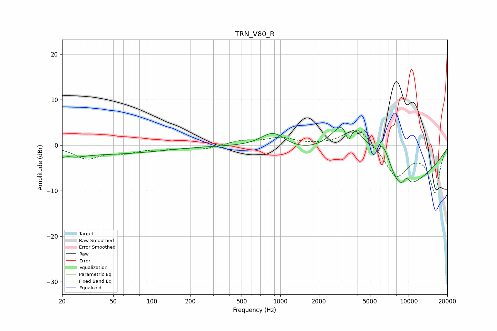

# TRN_V80_R
See [usage instructions](https://github.com/jaakkopasanen/AutoEq#usage) for more options and info.

### Parametric EQs
Apply preamp of -4.0 dB when using parametric equalizer.

|   # | Type    |   Fc (Hz) |    Q |   Gain (dB) |
|-----|---------|-----------|------|-------------|
|   1 | Peaking |        21 | 1.25 |        -2.2 |
|   2 | Peaking |        22 | 3.66 |         0.7 |
|   3 | Peaking |        53 | 0.38 |        -1.7 |
|   4 | Peaking |       880 | 1.46 |         3.6 |
|   5 | Peaking |      3389 | 1.16 |        15.4 |
|   6 | Peaking |      3399 | 4.64 |        -6.5 |
|   7 | Peaking |      6365 | 1.11 |        17.2 |
|   8 | Peaking |      6369 | 0.46 |       -20   |
|   9 | Peaking |      8561 | 1.19 |        -4.1 |
|  10 | Peaking |      9606 | 5.01 |         2   |

### Fixed Band EQs
When using fixed band (also called graphic) equalizer, apply preamp of **-3.4 dB** (if available) and set gains manually with these parameters.

|   # | Type    |   Fc (Hz) |    Q |   Gain (dB) |
|-----|---------|-----------|------|-------------|
|   1 | Peaking |        31 | 1.41 |        -2.8 |
|   2 | Peaking |        62 | 1.41 |        -1.3 |
|   3 | Peaking |       125 | 1.41 |        -0.6 |
|   4 | Peaking |       250 | 1.41 |        -0.9 |
|   5 | Peaking |       500 | 1.41 |         0.9 |
|   6 | Peaking |      1000 | 1.41 |         1.5 |
|   7 | Peaking |      2000 | 1.41 |        -0   |
|   8 | Peaking |      4000 | 1.41 |         4.3 |
|   9 | Peaking |      8000 | 1.41 |        -6.9 |
|  10 | Peaking |     16000 | 1.41 |       -10.2 |

### Graphs

