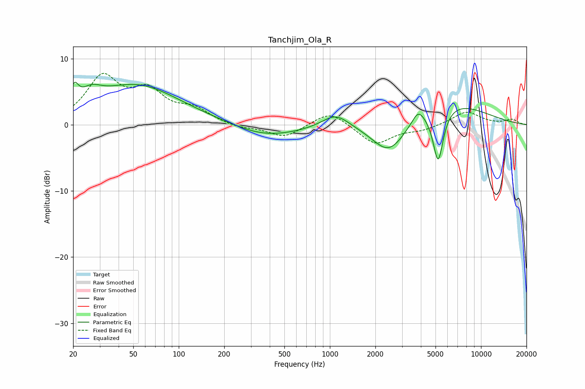

# Tanchjim_Ola_R
See [usage instructions](https://github.com/jaakkopasanen/AutoEq#usage) for more options and info.

### Parametric EQs
Apply preamp of -6.5 dB when using parametric equalizer.

|   # | Type    |   Fc (Hz) |    Q |   Gain (dB) |
|-----|---------|-----------|------|-------------|
|   1 | Peaking |        20 | 5.37 |         2.7 |
|   2 | Peaking |        26 | 2.14 |         1.9 |
|   3 | Peaking |        52 | 0.48 |         6   |
|   4 | Peaking |       331 | 0.87 |        -0.8 |
|   5 | Peaking |       457 | 0.64 |        -1.1 |
|   6 | Peaking |      1091 | 1.58 |         2.2 |
|   7 | Peaking |      2462 | 1.25 |        -5   |
|   8 | Peaking |      3839 | 3.49 |         2   |
|   9 | Peaking |      5205 | 4.03 |        -8.2 |
|  10 | Peaking |      5997 | 0.57 |         3.7 |

### Fixed Band EQs
When using fixed band (also called graphic) equalizer, apply preamp of **-7.9 dB** (if available) and set gains manually with these parameters.

|   # | Type    |   Fc (Hz) |    Q |   Gain (dB) |
|-----|---------|-----------|------|-------------|
|   1 | Peaking |        31 | 1.41 |         6.9 |
|   2 | Peaking |        62 | 1.41 |         4.4 |
|   3 | Peaking |       125 | 1.41 |         2.1 |
|   4 | Peaking |       250 | 1.41 |        -0.5 |
|   5 | Peaking |       500 | 1.41 |        -1.9 |
|   6 | Peaking |      1000 | 1.41 |         2.2 |
|   7 | Peaking |      2000 | 1.41 |        -3   |
|   8 | Peaking |      4000 | 1.41 |        -0.7 |
|   9 | Peaking |      8000 | 1.41 |         2   |
|  10 | Peaking |     16000 | 1.41 |         0.8 |

### Graphs

