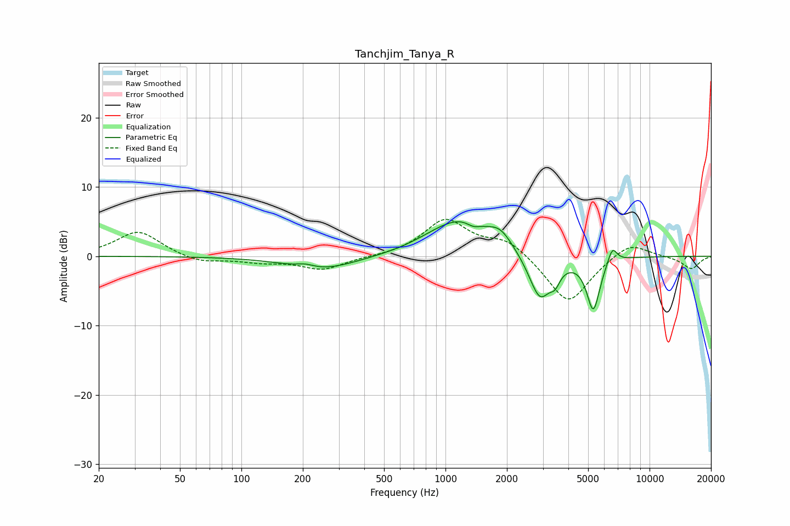

# Tanchjim_Tanya_R
See [usage instructions](https://github.com/jaakkopasanen/AutoEq#usage) for more options and info.

### Parametric EQs
Apply preamp of -5.1 dB when using parametric equalizer.

|   # | Type    |   Fc (Hz) |    Q |   Gain (dB) |
|-----|---------|-----------|------|-------------|
|   1 | Peaking |       205 | 3.39 |         0.5 |
|   2 | Peaking |       248 | 0.83 |        -2   |
|   3 | Peaking |       884 | 1.21 |         0.5 |
|   4 | Peaking |      1201 | 0.95 |         4.9 |
|   5 | Peaking |      1368 | 4.6  |        -0.7 |
|   6 | Peaking |      1861 | 2.44 |         2.1 |
|   7 | Peaking |      2903 | 2.55 |        -6.6 |
|   8 | Peaking |      3445 | 6    |        -1.7 |
|   9 | Peaking |      5302 | 4.27 |        -7.6 |
|  10 | Peaking |      6573 | 5.99 |         2.4 |

### Fixed Band EQs
When using fixed band (also called graphic) equalizer, apply preamp of **-5.4 dB** (if available) and set gains manually with these parameters.

|   # | Type    |   Fc (Hz) |    Q |   Gain (dB) |
|-----|---------|-----------|------|-------------|
|   1 | Peaking |        31 | 1.41 |         3.7 |
|   2 | Peaking |        62 | 1.41 |        -1   |
|   3 | Peaking |       125 | 1.41 |        -0.7 |
|   4 | Peaking |       250 | 1.41 |        -1.9 |
|   5 | Peaking |       500 | 1.41 |        -0.1 |
|   6 | Peaking |      1000 | 1.41 |         5.2 |
|   7 | Peaking |      2000 | 1.41 |         2.4 |
|   8 | Peaking |      4000 | 1.41 |        -7   |
|   9 | Peaking |      8000 | 1.41 |         2.3 |
|  10 | Peaking |     16000 | 1.41 |        -1.8 |

### Graphs

