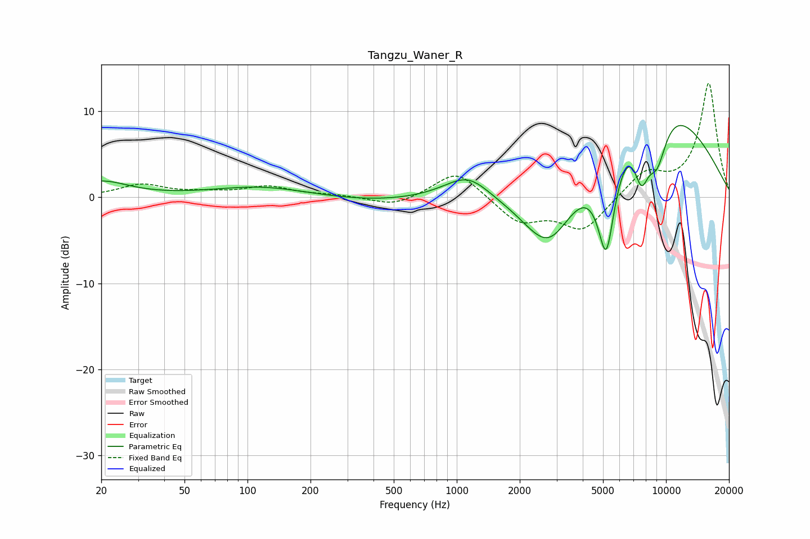

# Tangzu_Waner_R
See [usage instructions](https://github.com/jaakkopasanen/AutoEq#usage) for more options and info.

### Parametric EQs
Apply preamp of -8.4 dB when using parametric equalizer.

|   # | Type    |   Fc (Hz) |    Q |   Gain (dB) |
|-----|---------|-----------|------|-------------|
|   1 | Peaking |        20 | 1.12 |         1.8 |
|   2 | Peaking |       117 | 0.61 |         1.3 |
|   3 | Peaking |       409 | 0.5  |        -0.6 |
|   4 | Peaking |      1146 | 1.24 |         3.1 |
|   5 | Peaking |      1395 | 1.41 |        -0.4 |
|   6 | Peaking |      2763 | 0.97 |        -9.9 |
|   7 | Peaking |      5184 | 2.96 |       -12.8 |
|   8 | Peaking |      7636 | 3.46 |        -6.2 |
|   9 | Peaking |      7949 | 0.41 |        14   |
|  10 | Peaking |      9032 | 2.42 |        -6.6 |

### Fixed Band EQs
When using fixed band (also called graphic) equalizer, apply preamp of **-13.3 dB** (if available) and set gains manually with these parameters.

|   # | Type    |   Fc (Hz) |    Q |   Gain (dB) |
|-----|---------|-----------|------|-------------|
|   1 | Peaking |        31 | 1.41 |         1.4 |
|   2 | Peaking |        62 | 1.41 |         0.4 |
|   3 | Peaking |       125 | 1.41 |         1.2 |
|   4 | Peaking |       250 | 1.41 |         0.2 |
|   5 | Peaking |       500 | 1.41 |        -1.1 |
|   6 | Peaking |      1000 | 1.41 |         3.2 |
|   7 | Peaking |      2000 | 1.41 |        -2.9 |
|   8 | Peaking |      4000 | 1.41 |        -3.8 |
|   9 | Peaking |      8000 | 1.41 |         2.8 |
|  10 | Peaking |     16000 | 1.41 |        13.2 |

### Graphs

