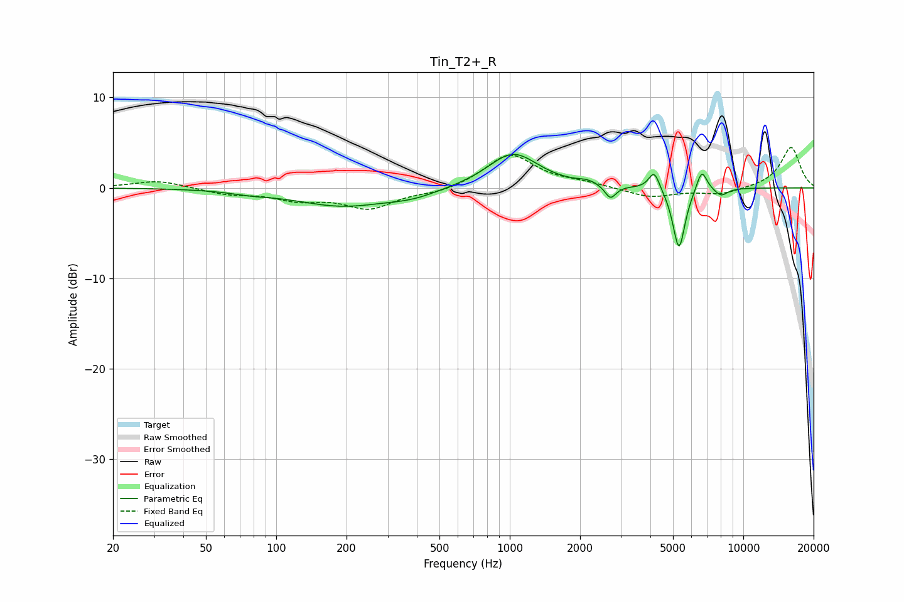

# Tin_T2+_R
See [usage instructions](https://github.com/jaakkopasanen/AutoEq#usage) for more options and info.

### Parametric EQs
Apply preamp of -3.8 dB when using parametric equalizer.

|   # | Type    |   Fc (Hz) |    Q |   Gain (dB) |
|-----|---------|-----------|------|-------------|
|   1 | Peaking |        78 | 1.65 |        -0.3 |
|   2 | Peaking |       192 | 0.71 |        -2   |
|   3 | Peaking |       383 | 1.3  |        -0.7 |
|   4 | Peaking |      1033 | 1.31 |         3.9 |
|   5 | Peaking |      2156 | 3.48 |         0.4 |
|   6 | Peaking |      2699 | 5.98 |        -1.5 |
|   7 | Peaking |      4156 | 6    |         2.1 |
|   8 | Peaking |      5304 | 5.34 |        -6.9 |
|   9 | Peaking |      6635 | 5.99 |         2.4 |
|  10 | Peaking |      8034 | 4.68 |        -0.9 |

### Fixed Band EQs
When using fixed band (also called graphic) equalizer, apply preamp of **-4.6 dB** (if available) and set gains manually with these parameters.

|   # | Type    |   Fc (Hz) |    Q |   Gain (dB) |
|-----|---------|-----------|------|-------------|
|   1 | Peaking |        31 | 1.41 |         0.8 |
|   2 | Peaking |        62 | 1.41 |        -0.7 |
|   3 | Peaking |       125 | 1.41 |        -1.2 |
|   4 | Peaking |       250 | 1.41 |        -2.2 |
|   5 | Peaking |       500 | 1.41 |        -0.6 |
|   6 | Peaking |      1000 | 1.41 |         3.7 |
|   7 | Peaking |      2000 | 1.41 |         0.4 |
|   8 | Peaking |      4000 | 1.41 |        -1.1 |
|   9 | Peaking |      8000 | 1.41 |        -0.7 |
|  10 | Peaking |     16000 | 1.41 |         4.5 |

### Graphs

