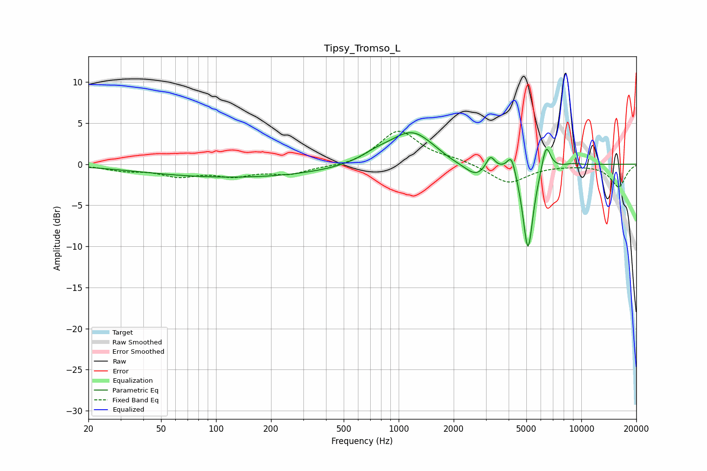

# Tipsy_Tromso_L
See [usage instructions](https://github.com/jaakkopasanen/AutoEq#usage) for more options and info.

### Parametric EQs
Apply preamp of -3.9 dB when using parametric equalizer.

|   # | Type    |   Fc (Hz) |    Q |   Gain (dB) |
|-----|---------|-----------|------|-------------|
|   1 | Peaking |       131 | 0.27 |        -1.6 |
|   2 | Peaking |       751 | 1.66 |         0.7 |
|   3 | Peaking |      1183 | 1.14 |         4   |
|   4 | Peaking |      1956 | 1.89 |        -0.4 |
|   5 | Peaking |      2643 | 2.3  |        -1.7 |
|   6 | Peaking |      3179 | 5.97 |         1.6 |
|   7 | Peaking |      4147 | 5.92 |         2.4 |
|   8 | Peaking |      5106 | 4.81 |       -10.7 |
|   9 | Peaking |      6414 | 5.72 |         3.4 |
|  10 | Peaking |      9040 | 4.13 |         0.2 |

### Fixed Band EQs
When using fixed band (also called graphic) equalizer, apply preamp of **-4.1 dB** (if available) and set gains manually with these parameters.

|   # | Type    |   Fc (Hz) |    Q |   Gain (dB) |
|-----|---------|-----------|------|-------------|
|   1 | Peaking |        31 | 1.41 |        -0.6 |
|   2 | Peaking |        62 | 1.41 |        -1.3 |
|   3 | Peaking |       125 | 1.41 |        -1.2 |
|   4 | Peaking |       250 | 1.41 |        -1.1 |
|   5 | Peaking |       500 | 1.41 |        -0.4 |
|   6 | Peaking |      1000 | 1.41 |         4.1 |
|   7 | Peaking |      2000 | 1.41 |         0.5 |
|   8 | Peaking |      4000 | 1.41 |        -2.4 |
|   9 | Peaking |      8000 | 1.41 |        -0.1 |
|  10 | Peaking |     16000 | 1.41 |        -2.7 |

### Graphs

